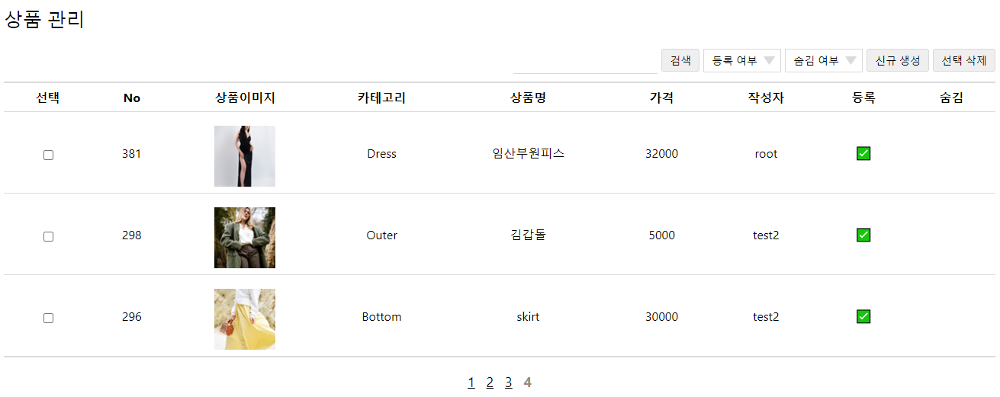

마이바티스 환경에서 페이징 처리를 편리하게 하기 위한 방법을 고민하다 `Pager` 클래스를 활용하여 여러 페이지에서 공통적으로 사용할 수 있는 방법을 생각해보았다.

## 코드
### Pager 클래스 생성

client 요청의 파라미터, db 조회 결과, view에 전달할 정보를 운반할 클래스를 생성한다. 테이블마다 추가로 필요한 속성이 있을 경우 상속을 받아 사용하였다.

```java
import lombok.AllArgsConstructor;
import lombok.Builder;
import lombok.Data;

/**
 * 페이징 처리를 위한 Pager 클래스
 *
 * @author taedi
 */
@Data
@Builder
@AllArgsConstructor
public class Pager {
    //client 요청 값
    private int pageNo; //페이지 번호
    private int amount; //한 페이지에 표시할 레코드 수
    private String category; //카테고리
    private String keyword; //검색 키워드
    private String order; //정렬 순서

    //server 설정
    private int linkCount; //하단 링크에 표시할 페이지 수

    //DB 조회 결과
    private int startRecord; // 페이지 시작 레코드(인덱스)
    private int totalRecords; //전체 레코드 수
    private int finalPageNo; //끝 페이지 번호

    private int startPage; //페이지 링크 시작 번호
    private int endPage; //페이지 링크 종료 번호

    private int prev; //이전 버튼에 부여할 페이지 번호
    private int next; //다음 버튼에 부여할 페이지 번호

    private Object records; //게시물을 담을 객체

    //별도 지정하지 않았을 경우의 기본 값
    public Pager() {
        this.pageNo = 1;
        this.amount = 10;
        this.order = "desc";
        this.linkCount = 10;
    }
}
```

### 컨트롤러 부분

컨트롤러에서는 uri 파라미터를 Pager 객체의 속성으로 저장하고 (amount, order, pageNo, category, keyword) mapper 조회 결과를 view 로 전송하는 역할을 한다.

```java
@GetMapping(params = {"section=product","func=list"})
public String getProductList(Pager pager, Model model) {

    //테이블 정보 조회(조건에 해당하는 정보)
    pager = itemMapper.getInfoForPaging(pager);

    //게시물 조회
    List<Item> list = itemMapper.selectItemList(pager);

    //pager 객체에 게시물 정보 담기
    pager.setRecords(list);

		//데이터 전달
    model.addAttribute("url", "content/product/product-list.jsp");
    model.addAttribute("result", pager);

    return "manage/manage";
}
```

### SQL mapper

페이징을 처리하려면 테이블에서 조건(category, keyword)을 만족하는 레코드의 수를 파악하여 현재 페이지에 몇 번째 글부터 표시해야 하는지와 전체 페이지 수를 계산하는 로직이 필요하다. 이 로직을 Pager 클래스에 메서드로 정의할지 DB에서 처리할지 고민하다 공부도 할 겸 DB 에서 모두 처리하여 전달하도록 구성하여보았다. 

#### 테이블 정보 조회

아래 쿼리를 실행하면 totalRecords, finalPageNo, startPage, endPage, prev, next 정보를 얻을 수 있다.

```xml
<select id="getInfoForPaging" parameterType="Pager" resultType="Pager">
    <![CDATA[
    SELECT `total_records`,
           `final_page_no`,
           `start_page`,
           if(@final_page > @end_page, @end_page, @final_page) `end_page`,
           @start_page - 1 `prev`,
           if(@final_page > @end_page, @end_page + 1, 0) `next`,
           (#{pageNo} - 1) * #{amount} `start_record`,
           #{amount} `amount`,
           #{pageNo} `page_no`,
           #{order} `order`,
           #{linkCount} `link_count`,
           #{category} `category`,
           #{keyword} `keyword`
    FROM (SELECT @total_recode := COUNT(*) `total_records`,
        @final_page := CEIL(COUNT(*) / #{amount}) `final_page_no`,
        @start_page := truncate(((#{pageNo} - 1) / #{linkCount}), 0) * #{linkCount} + 1 `start_page`,
        @end_page := truncate(((#{pageNo} - 1) / #{linkCount}), 0) * #{linkCount} + #{linkCount}
        FROM `item`
    ]]>
    <where>
        <if test="category != null and category != ''">
            `category` = #{category}
        </if>
        <if test="keyword != null and keyword != ''">
            AND `title` LIKE CONCAT('%', #{keyword}, '%')
        </if>
    </where>
    ) a
</select>
```

#### 게시물 조회

그리고 조회한 내용을 바탕으로 실제 게시물 데이터를 받아온다.

```xml
<select id="selectItemList" parameterType="Pager" resultMap="itemMap">
    SELECT *
    FROM `item`
    <where>
        <if test="category != null and category != ''">
            `category` = #{category}
        </if>
        <if test="keyword != null and keyword != ''">
            AND `title` LIKE CONCAT('%', #{keyword}, '%')
        </if>
    </where>
    ORDER BY `no` ${order}
    LIMIT #{startRecord}, #{amount}
</select>
```

### JSP 링크 부분

페이지 번호를 제외한 기존의 파라미터를 그대로 유지하기 위해 link 변수를 설정하고, 각 버튼마다 (사실은 a태그) link 변수에 pageNo 를 추가한 uri를 부여하였다.

```xml
<%-- 기본 링크 설정 --%>
<c:set var="link"
       value="manage?section=product&func=list&amount=${requestScope.result.amount}&order=${requestScope.result.order}"/>
<c:if test="${requestScope.result.category ne null}">
    <c:set var="link" value="${link}&category=${requestScope.result.category}"/>
</c:if>
<c:if test="${requestScope.result.keyword ne null}">
    <c:set var="link" value="${link}&keyword=${requestScope.result.keyword}"/>
</c:if>

<%-- 이전 버튼 --%>
<c:if test="${requestScope.result.prev > 0}">
    <a href="${link}&pageNo=${requestScope.result.prev}">이전</a>&nbsp;
</c:if>

<%-- 페이지번호 --%>
<c:forEach begin="${requestScope.result.startPage}" end="${requestScope.result.endPage}" step="1" varStatus="i">
    <c:set var="pgNo" value="${requestScope.result.startPage + i.count - 1}"/>
    <c:choose>
        <c:when test="${pgNo ne requestScope.result.pageNo}">
            &nbsp;<a href="${link}&pageNo=${pgNo}">${pgNo}</a>&nbsp;
        </c:when>
        <c:when test="${pgNo eq requestScope.result.pageNo}">&nbsp;<span id="now_page">${pgNo}</span>&nbsp;</c:when>
    </c:choose>
</c:forEach>

<%-- 다음 버튼 --%>
<c:if test="${requestScope.result.next > 0}">
    &nbsp;<a href="${link}&pageNo=${requestScope.result.next}">다음</a>
</c:if>
```

## 참고

- [https://badstorage.tistory.com/13](https://badstorage.tistory.com/13)