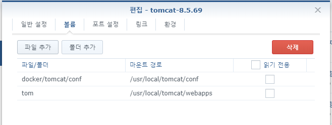
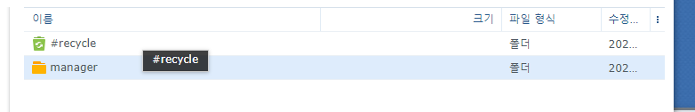
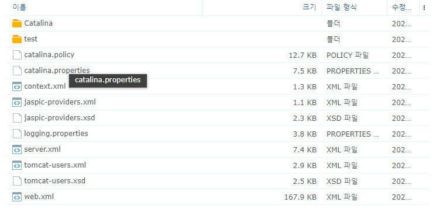
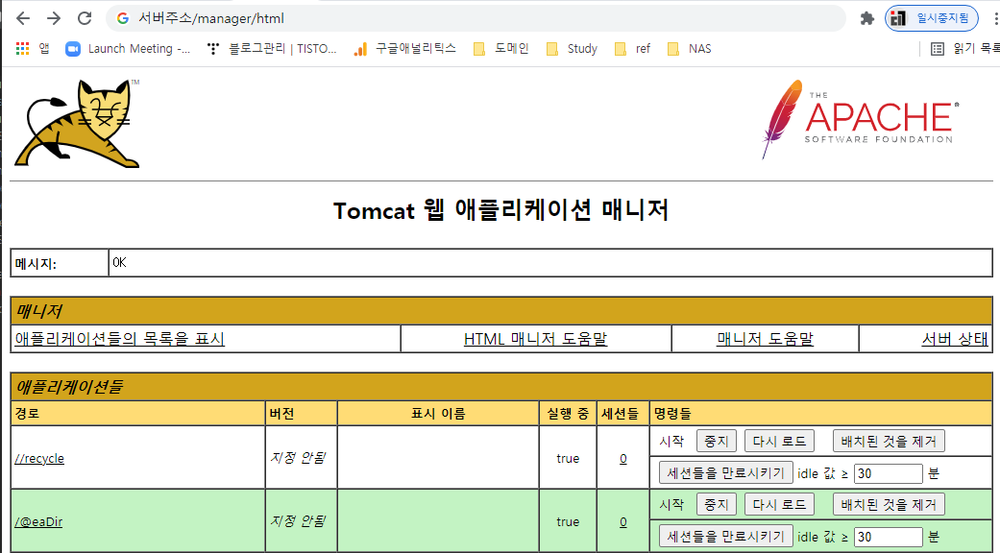
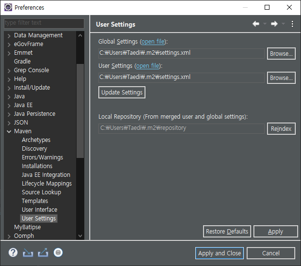
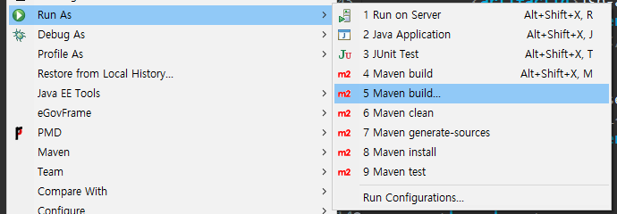
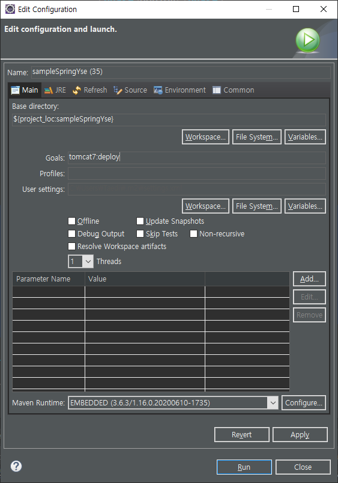
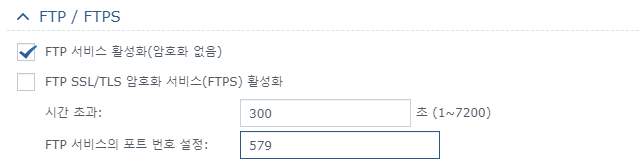
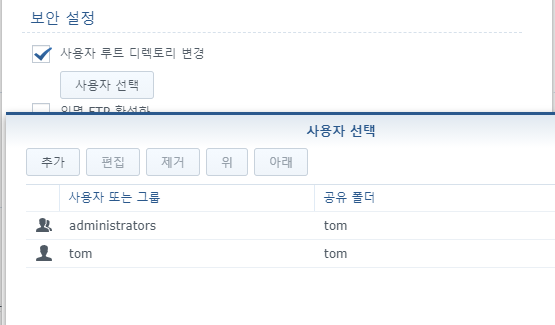
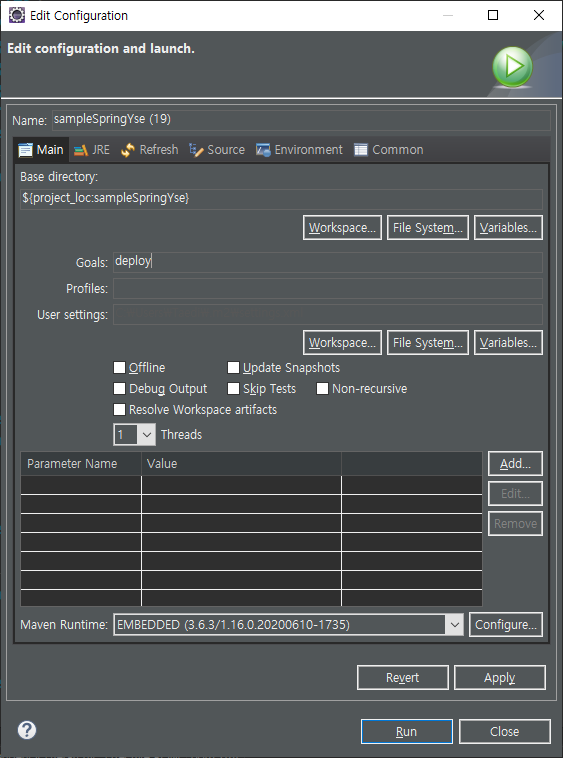

외부 톰캣에 프로젝트를 배포하기 위해서는 war 파일을 직접 업로드 하여야하는데, 이걸 IDE에서 run 할때 바로 처리하는 방법을 알아보았다. (이해가 부족하여 문장이 뒤죽박죽..)

#### 작업 환경

- 시놀로지 Docker - **tomcat-8.5.69버전**
- IDE - eGov3.10

## 시놀로지 세팅

---

ssh 와 vi를 다루는 데 능숙하지 않기 때문에 시놀로지 gui 환경에서 작업을 처리할 방법을 구상해 보았다. 

### 볼륨 마운트

- 작업 편의성을 위하여 외부 폴더들에 conf 와 webapps 경로를 마운트 해주었다.
- '컨테이너 선택 > 편집 > 볼륨' 으로 이동하여 아래와 같이 폴더를 마운트 하였다. 
(폴더 경로는 임의로 변경해도 무방하다.)



여기서 conf 폴더는 tomcat 관련 설정파일들이 있는 것으로 보이고, webapps는 배포할 프로젝트들을 업로드할 공간이다.

### 마운트한 폴더에 데이터 붙여 넣기

- '컨테이너 선택 > 설정 > 내보내기' 를 통해 docker에 설치 된 tomcat을 로컬 저장소에 백업
- 이후 압축을 해제하고
usr/local/tomcat/conf  
usr/local/tomcat/webapps.dist/manager
경로의 내용을 마운트한 폴더에 복사

#### webapps 폴더에 마운트되는 경로에 manager 폴더 복사



#### conf 폴더에 마운트되는 경로에 기존 conf 하위 파일들 복사



시놀로지에서 세팅은 여기까지며, 이후 웹 어플리케이션을 사용하는 방식과 ftp를 활용하는 방식 중에 선택하여 설정이 가능하다.(ssh 방식 등 알아보지 않은 다른 방법들이 있음)

### 첫번째 방법. Tomcat 웹 어플리케이션 활용

---

### conf > tomcat-users.xml 파일 내용 추가

- 아이디, 패스워드는 manager 페이지 접속에 사용

```xml
<role rolename="manager-gui" />
	<role rolename="manager-script" />
	<role rolename="manager-jmx" />
	<role rolename="manager-status" />
	<user username="아이디" password="패스워드"
		roles="manager-gui,manager-script,manager-jmx,manager-status" />
```

### manager >  META-INF > context.xml 파일 수정

- valve ~ 부분 주석처리

```xml
<Context antiResourceLocking="false" privileged="true" >
  <CookieProcessor className="org.apache.tomcat.util.http.Rfc6265CookieProcessor"
                   sameSiteCookies="strict" />
  <!--<Valve className="org.apache.catalina.valves.RemoteAddrValve"
         allow="127\.\d+\.\d+\.\d+|::1|0:0:0:0:0:0:0:1" />-->
  <Manager sessionAttributeValueClassNameFilter="java\.lang\.(?:Boolean|Integer|Long|Number|String)|org\.apache\.catalina\.filters\.CsrfPreventionFilter\$LruCache(?:\$1)?|java\.util\.(?:Linked)?HashMap"/>
</Context>
```

### 서버주소/manager/html 접속 확인

- 로그인 이후 아래와 같은 페이지가 정상적으로 표시되는지 확인



#### pom.xml 내용 추가

- tomcat8-maven-plugin 은 없으며 7버전으로 정상적으로 동작함
- url과 로그인 정보는 보안을 위해 settings.xml에 별도 설정

```xml
<plugin>
    <groupId>org.apache.tomcat.maven</groupId>
    <artifactId>tomcat7-maven-plugin</artifactId>
    <version>2.2</version>
    <configuration>
        <url>${tomcat-server-url}</url>
        <server>tomcat-server</server>
        <path>/${name}</path>
    </configuration>
</plugin>
```

#### settings.xml 내용 추가

- 기본적으로 C:\Users\사용자\.m2 경로에 있음
- window > preferences > maven > user settings 에서 위치 변경가능



```xml
<?xml version="1.0" encoding="UTF-8"?>

<settings xmlns="http://maven.apache.org/POM/4.0.0"
	xmlns:xsi="http://www.w3.org/2001/XMLSchema-instance"
	xsi:schemaLocation="http://maven.apache.org/POM/4.0.0 http://maven.apache.org/xsd/settings-1.0.0.xsd">
	<servers>
		<server>
			<id>tomcat-server</id>
			<!-- 아이디 -->
			<username>아이디</username>
			<!-- 비밀번호 -->
			<password>비밀번호</password>
		</server>
	</servers>

	<profiles>
		<profile>
      		<id>inject-tomcat-server-url</id>
      		<properties>
			  	  <!-- 서버 주소 -->
        		<tomcat-server-url>http://사이트 주소:포트번호/manager/text</tomcat-server-url>
      		</properties>
    	</profile>
  	</profiles>
    
  	<activeProfiles>
    	<activeProfile>inject-tomcat-server-url</activeProfile>
  	</activeProfiles>

</settings>
```

url까지 pom.xml에서 빼려다보니 settings.xml의 코드가 늘어났다.

#### Maven build

- 프로젝트 우클릭 > Run As > Maven build



- Goals에 tomcat7:deploy 입력 후 run!



### 두번째 방법. FTP 활용

---

ftp를 사용하려면 시놀로지 설정이 조금 더 필요하며 보안 부분에도 고려해야할 사항이 발생할 것으로 보인다. (그래서 사실 최초에 ftp를 이용해서 deploy 여부를 확인만 하고 첫번째 방식인 웹 어플리케이션 방식으로 변경하였다.)

#### 제어판 > 파일 서비스 > FTP > FTP 서비스 활성화

- 서비스 활성화 및 포트 설정 (사설 IP 외부 접속의 경우 포트 포워딩 필요)



#### 제어판 > 파일 서비스 > FTP > 일반 > 고급설정 > 루트 디렉토리 변경

- 순수 tomcat 용도로만 ftp가 필요하기 때문에 루트 폴더를 webapps 에 마운트 될 디렉토리로 한정 해줌



#### pom.xml 수정

```xml

    <!-- project 내부 -->
    <distributionManagement>
        <repository>
            <id>repo</id>
            <url>ftp://주소:포트번호/</url>
        </repository>
    </distributionManagement>

    <!-- build 내부 -->
		<extensions>
			<extension>
				<groupId>org.apache.maven.wagon</groupId>
				<artifactId>wagon-ftp</artifactId>
				<version>3.2.0</version>
			</extension>
		</extensions>
```

#### settings.xml 수정

- 기본적으로 C:\Users\사용자\.m2 경로에 있음
- window > preferences > maven > user settings 에서 위치 변경가능


- id 태그 안의 값은 pom.xml의 내용과 동일해야함

```xml
  <server>
      <id>repo</id>
      <username>계정</username>
      <password>비밀번호</password>
    </server>
  </servers>
```

#### Maven build

- 프로젝트 우클릭 > Run As > Maven build


- Goals에 deploy 입력 후 run!



## References

---

[http://maven.apache.org/wagon/wagon-providers/wagon-ftp/](http://maven.apache.org/wagon/wagon-providers/wagon-ftp/)

[https://m.blog.naver.com/PostView.naver?isHttpsRedirect=true&blogId=javaking75&logNo=220947560568](https://m.blog.naver.com/PostView.naver?isHttpsRedirect=true&blogId=javaking75&logNo=220947560568)

[https://hongku.tistory.com/196](https://hongku.tistory.com/196)

[https://www.baeldung.com/tomcat-deploy-war](https://www.baeldung.com/tomcat-deploy-war)

[https://maven.apache.org/examples/injecting-properties-via-settings.html](https://maven.apache.org/examples/injecting-properties-via-settings.html)