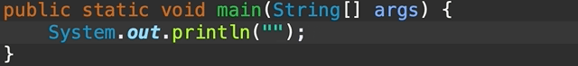
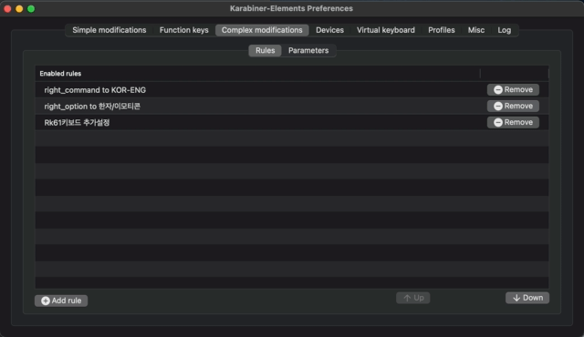
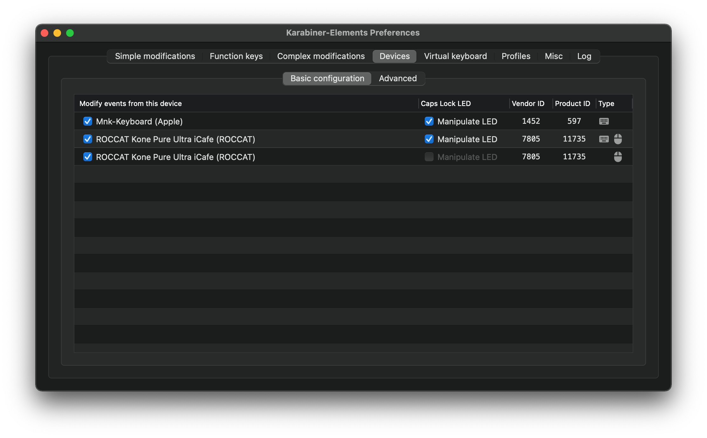
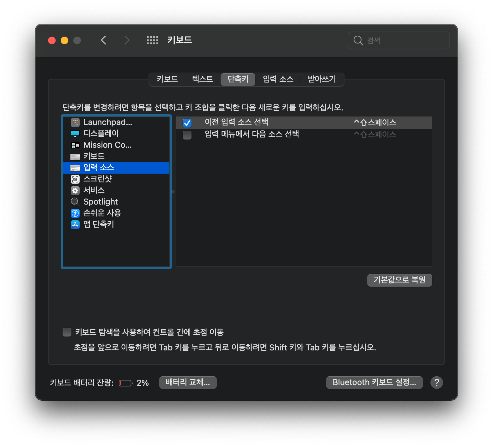
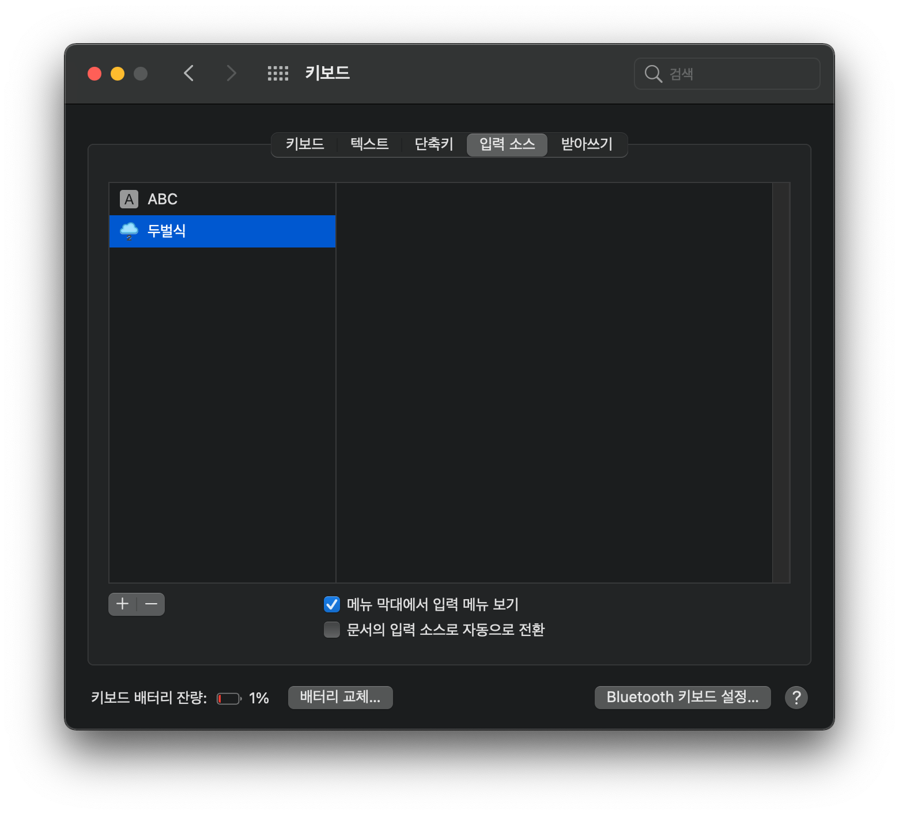

## 서론

맥에서 이클립스를 사용하려면 불편함을 감수해야하는 부분이 있는데 그중에서도 제일은 `한글 짤림` 현상일 것이다. 이것은 한글 타이핑 시 마지막에 입력한 글자가 지워지는 현상인데, 이를 방지하려면 문장 작성 후 esc, enter, space 키 등을 입력 해주어야 하는 번거로움이 있다. (SQL 클라이언트 툴인 `Dbeaver` 또한 동일한 증상을 가지고 있다.)



구글 검색을 해보니 2013년 이전부터 리포팅 되어왔으나 프로그램 개선이나 해결책이 없는 채로 방치된 문제로 보였고, 여러 포스팅에서 `맞춤법 자동 수정` 을 해제하라는 말이 있었지만 일단 현재기준으로 전혀 먹히지 않는다.

결국, 개인적인 삽질 끝에 `Karabiner-Elements` 를 활용해서 불편함을 어느정도 해소할 수 있는 방법을 찾아보았다.

바쁘신 분들은 아래에 적용 방법 부분만 확인하시길!

## 원인 분석

추측건대 한글은 자모를 조합하여 문자가 되는 특성 때문에 영어처럼 바로 입력되지 않고 문자가 완성되기 까지 임시공간에 있다가 에디터에서 문자가 완성되었다고 판단하는 시점에 비로소 입력이 되는 것으로 보이는데, 다른 에디터와 비교해 이클립스에서 이 판단을 심도있게 고려해주지 않은 듯 하다. ~~대충 이클립스가 판단력이 나쁘다는 말~~

그래서 일부 키 입력은 기존에 작성중인 임시 상태의 한글 입력을 취소시켜버린다. 글에서는 대충 `문제 키` 라는 표현으로 신호들을 다루겠다.

- backspace
- 방향키
- cmd+e 같은 단축키
- 한영 전환
- 마우스 버튼

반면에 다음 입력신호는 직전까지 작성한 자모 조합을 완성 된 글자로 전환시킨다. 글에서는 `탈출 키` 라고 표현하겠다.

- escape
- space
- enter
- tab
- 숫자 & 기호
- (다음 한글 자모)

단, 여기서 `enter` 키는 `탈출 키` 기능을 수행할 때 본연의 업무 (줄바꿈)를 수행하지 않는 문제가 발생한다.

결론적으로 한글 자모 입력 후 `문제 키` 와 `enter` 키 입력 이벤트가 발생했을 때 작성중인 한글을 완성시키는 장치가 필요하다 판단했다.

## 아이디어

Karabiner-Elements 는 키보드와 마우스 입력신호를 조건에 따라(conditions) 다른 신호로 맵핑해주는 Complex modifications 기능을 제공하고있어 이 방식을 사용하였다. 비슷한 기능을 제공하는 다른 프로그램 또는 내장 방식이 있다면 해당 방식을 사용해도 무방할듯 하다.

처음에는 모든 입력 신호를 감지하여 한글 자모와 그 외의 입력으로 구분하고, `문제 키` 직전의 최종 키가 한글이었는지 여부를 조사해 그에 맞는 동작을 하게 할까 생각해보았지만 Karabiner-Elements 에서 제공하는 방식으로는 json 코드만 수천줄이 넘어가기도 하고 조건 구문도 많아져 키입력 딜레이가 발생할 수도 있지않을까 하는 부분 때문에 포기하였다. 하지만 아래 시행착오를 겪었고 결국에 이 방법을 선택하게 되었다.

### 시행착오 1

처음으로 시도한 것이 `문제 키` 들이 입력되는 순간에 esc 키를 먼저 입력해 작성중인 자모 조합이 완성 된 문자가 되도록 하는 간단한 아이디어였다. 

```json
{
  "title": "이클립스 한글 짤림 해결",
  "rules": [
    {
      "description": "이클립스_백스페이스",
      "manipulators": [
        {
          "type": "basic",
          "from": {
            "key_code": "delete_or_backspace"
          },
          "parameters": {
            "basic.to_if_held_down_threshold_milliseconds": 10
          },
          "conditions": [
            {
              "type": "frontmost_application_if",
              "bundle_identifiers": [
                "^org\\.eclipse\\.platform\\.ide$"
              ]
            },
            {
              "type": "input_source_if",
              "input_sources": [
                {
                  "language": "^ko$",
                  "input_source_id": "^com\\.apple\\.inputmethod\\.Korean\\.2SetKorean$"
                }
              ]
            }
          ],
          "to": [
            {
              "key_code": "escape"
            }
          ],
          "to_after_key_up": [
            {
              "key_code": "delete_or_backspace"
            }
          ],
          "to_if_held_down": [
            {
              "key_code": "delete_or_backspace",
              "halt": true
            }
          ]
        }
      ]
    }
  ]
}
```

코드 일부를 간단히 설명하자면

- conditions(조건) - 입력 소스가 한글이고, 최상단 앱이 이클립스 일 경우에
- from(입력 받은 키값) - backspace 가 입력되면
- to(변경할 키값) - esc + backspace 로 입력을 전환

하는 간단한 내용으로 이루어져있다.

enter, tab, space 키들은 경우에 따라 작성한 코드가 변형(줄바꿈, 들여쓰기, 띄어쓰기)될 수 있기 때문에 가장 리스크가 덜한 것이 esc 키 였지만 이마저도 문제점이 있었다. 바로 클래스 생성과 같은 창과 상단 메뉴, 팝업 등에서 esc 키가 입력되어 창이 종료되는 문제가 발생했고 이것도 자주 겪으니 불편하기 짝이없었다.

추가적으로 한글입력을 하지 않았더라도 시스템 입력 소스가 한글이면 무조건 동작하기 때문에 예상치 않은 문제가 지속적으로 발생하는 문제도 있었다.

### 시행착오 2

1번에서 시도한 방식에서 esc 키를 `Caps Lock` 키 2회 반복으로 변경하여 보았다. 맥 에서는 자체적으로 `Caps Lock` 키를 한영 전환키로 사용할 수 있는 기능이 있는데, 이를 이용해 입력 소스를 전환하면 작성한 글이 짤리지 않는다. 


`Caps Lock` 키를 이용하면 작성하던 코드가 훼손되지도 않고 팝업이나 메뉴 창이 의도치 않게 꺼지는 현상도 잡을 수 있지만, 일단 키입력 딜레이가 너무 크다(0.4초 정도). 딜레이를 줄이면 정상적으로 동작하지 않았고, 때문에  그만큼 부자연스러움이 커지는 문제가 발생했다.

또한, 키조합 상황에서는 먹히지 않는다는 단점도 존재했다. cmd + s, shift + 방향키 등 키를 누른상태에서는 `Caps Lock` 키가 동작하지 않았다.

```json
"key_code": "caps_lock",
"hold_down_milliseconds": 200
```

### 잠정적 결론

처음에 미친짓이라 생각했던 모든 키의 입력을 받아 처리하는 방식을 선택했다. (적어도 내 수준에서는 이게 가장 섹시한 방법인듯 하다.) 우려와 같이 딜레이가 발생한다던지 하는 상황은 발생하지 않았고, 긴 코드 작업도 python 반복문으로 해결했다.

이 방식이 불가피하다고 판단한 사유는 다음과 같다.

- karabiner 만으로는 이클립스 내부에 어떤 창에 현재 포커스가 잡혀있는지 확인할 수 없다. 에디터, 콘솔,  네비게이터, 메뉴창 등 작업에 따라 다른 조건을 부여할 수 없다. (메뉴창에서만 esc키 말고 다른방법 쓰면되지! 가 안먹힌다는 말)
- 직전 입력 신호가 한글 키 일때만 동작을 수행하려면 모든 키 입력 감지가 불가피하다.

위의 두가지 사유를 해결할 수 있는 솔루션이 있다면 좀 더 간결한 방법이 나올 수 있을 것 같다.

방식을 간단하게 설명하자면 우선 입력 신호를 한글 키, 영문 키 및 `탈출 키`, `문제 키` 의 세개 분류로 나누었고 신호가 입력될 때 아래와 같은 로직을 수행한다.

- 한글 키가 입력 될 경우 변수를 1로 저장
- 영문 키 및 `탈출 키` 가 입력 될 경우 변수를 0으로 저장
- `문제 키` 가 입력 될 경우, 변수가 1일 경우에만 space + backspace 조합으로 한글을 완성시키고 변수를 0으로 저장

코드는 5,000줄 가량 되어 아래에 깃허브 링크로 대체하였다.

## 적용 방법

### 1. Karabiner-Elements 설치

Karabiner-Elements [설치](https://karabiner-elements.pqrs.org/)

### 2. .json 파일 다운로드

.json 파일은 [여기](https://github.com/taedi90/eclipse_kor_fix/releases)에서 다운로드 가능하다. 

json 파일을 생성할 때 사용한 python 코드도 같이 확인할 수 있다. (json 라이브러리도 있던데 그냥 쌩 텍스트로 작업했다.)

아래 경로에 다운로드 받은 .json 파일을 위치시킨다.

> ~/.config/karabiner/assets/complex_modifications  
>   

### 3. 설정 추가

Karabiner-Elements Preferences > Complex modifications 탭에서 필요한 규칙들을 추가해주면 된다. 기존에 다른 규칙들을 사용하고 있는 경우 정상적으로 작동하지 않을 수 있으니 상단으로 올려 우선순위를 높여주면 된다.



마우스 관련 옵션을 사용하기 위해서는 아래 두가지 설정이 더 필요하다.

Karabiner-Elements Preferences > Devices 에서 사용하는 마우스가 체크 되어있는지 확인해야한다.



오른쪽 커맨드 버튼을 한영 전환 키로 사용할 경우에는 시스템 환경설정에 단축키를 아래와 같이 변경한다.



## 현재까지 발견 된 문제점

현재까지 발견한 문제는 다음과 같으며 이 밖에도 다른 문제가 있을 수 있으니 유의할 것!

1. 한글 입력 직후 빠르게 cmd + s 등의 키조합을 사용하려할 경우, 올바르게 동작하지 않는 현상 - 
*cmd키를 누르고 0.2초 이상 지난 후에 s 버튼을 눌러야 정상적으로 동작함*
2. 한글입력 중 backspace 시 '종성' - '중성' - '초성' 순으로 지워지는 것이 아니라 한개 글자가 바로 삭제 되는 현상 - *2021.10.17 추가 내용 참고*

그리고 최고의 해결책은 이클립스를 포기하고 `intellij`를 사용하는 것이다. 

## 2021.10.17 추가

구름 입력기를 쓴다면 backspace 는 Complex modifications 에서 제외시키면서 `문제점 2번` 을 해결할 수 있다.




