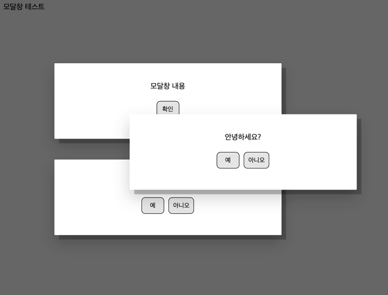

프로젝트를 진행하면서 알림이나 서브 컨텐츠를 `alert` 창이나 `pop-up window`를 이용하지 않고 처리하고싶은 욕심이 생겨 모달창을 공부해보았다. 

## 시도해본 것

- 여러 창을 동시에 띄울 수 있어야 하고, 포커싱 된 요소가 최상단에 위치해야한다.
- 버튼을 눌렀을 때 예약된 함수를 불러올 수 있어야 한다.
- 드래그&드롭으로 이동이 가능해야한다.
- html, css에 별도로 구성요소를 세팅하지 않고 .js 파일 링크만으로 동작해야한다.

## 동작 영상



## 코드

```jsx
'use strict';

/**
 * Vanilla JavaScript 모달 알림창 스크립트
 *
 * @param {string} html - (optional) 모달창 내용
 * @param {int} kind - (optional) 버튼 종류 (1: 확인, 2: 예&아니오)
 * @param {function} confirmCallback - (optional) 확인, 예 클릭 후 실행 함수
 * @param {function} cancelCallback -  (optional) 아니오 클릭 후 실행 함수
 *
 * @example
 * const modalContainer = new ModalContainer();
 * modalContainer.add("모달창 내용", 1, ()=>{alert("콜백")});
 *
 * @author taedi <taedi90@gmail.com>
 */

class ModalContainer {
    //setting
    container = document.querySelector("#modal_container"); //모달창이 생성 될 부모 요소
    idNum = 1; //모달창 식별 번호
    zIndexCount = 100; //z-index 시작값, 다른 요소보다 뒤에 표시되면 값을 상향 조정
    modals = new Map(); //모달 맵

    //style 설정
    styleContainer = `position: fixed;top: 0;left: 0;width: 100%;height: 100%;z-index:${this.zIndexCount};`;
    styleOverlay = `background-color: rgba(0,0,0,0.6);width: 100%;height: 100%;position: absolute;`;
    styleModal = `background-color: white;
                padding: 2.5rem 5rem;
                text-align: center;
                position: absolute;
                width: 20rem;
                border-radius: 0.1rem;
                box-shadow: 0 1rem 2rem rgba(0, 0, 0, 0.19), 0.6rem 0.6rem rgba(0, 0, 0, 0.23);
                font-size: inherit;`;
    styleButtonContainer = `margin-top:1rem;`;
    styleButton = `padding: 0.5rem; 
                margin: 0.3rem;
                background-color:#e5e5e5;
                border: 0.1rem solid black;
                border-radius: 0.5rem;
                min-width: 3rem;
                cursor: pointer;
                `;

    //생성자
    constructor() {
        this.initContainer(); //컨테이너 생성
        this.initOverlay(); //오버레이 생성

        // 마우스가 범위를 벗어날 수 있기 때문에 move, up은 컨테이너 전체에 할당
        this.container.addEventListener('mouseup', ()=>{this.endPointing()});
        this.container.addEventListener('touchend', ()=>{this.endPointing()});
        this.container.addEventListener('mousemove', (e)=>{this.movePointing(e)});
        this.container.addEventListener('touchmove', (e)=>{this.movePointing(e)});
    }

    // 컨테이너 초기화
    initContainer(){
        if (this.container == null){ //없을 경우 생성
            this.container = document.createElement("div");
            this.container.id = "modal_container";
            document.body.appendChild(this.container);
        } else { //있을 경우 초기화
            while (this.container.firstChild) {
                this.container.removeChild(this.container.lastChild);
            }
        }
        this.container.style = this.styleContainer;
        this.hideContainer();
    }

    //컨테이너 활성
    showContainer(){
        this.container.style.display = 'block';
    }

    //컨테이너 숨기기
    hideContainer(){
        this.container.style.display = 'none';
    }

    //오버레이 생성
    initOverlay(){
        this.overlay = document.createElement("div");
        this.overlay.id = "modal_overlay";
        this.overlay.style = this.styleOverlay;
        this.container.appendChild(this.overlay);
    }

    //모달창 생성
    add(html = "", //모달창 내용
        kind = 1, //모달창 종류(1 : 확인, 2 : 예 & 아니오)
        confirmCallback = () => {}, //확인 or 예 클릭할 때 콜백 함수
        cancelCallback = () => {} //아니오 클릭할 때 콜백 함수
    ){

        const id = "modal" + this.idNum++;
        let callbackObject = {};

        //모달 요소 생성
        const modalWindow = document.createElement("div");
        modalWindow.id = id;
        modalWindow.style = this.styleModal;
        modalWindow.style.zIndex = this.zIndexCount++;
        modalWindow.className = "modal_window";

        //모달 내용
        const modalContent = document.createElement("div");
        modalContent.className = "modal_content";
        modalContent.innerHTML = html;
        modalWindow.appendChild(modalContent);

        //버튼
        const buttonBox = document.createElement("div");
        buttonBox.style = this.styleButtonContainer;

        //버튼 종류 설정(1 : 확인, 2 : 예 & 아니오)
        let buttonConfirm;
        let buttonCancel;
        if(kind == 1) {
            callbackObject["confirmCallback"] = confirmCallback;
            buttonConfirm = document.createElement("button");
            buttonConfirm.className = "button_confirm";
            buttonConfirm.style = this.styleButton;
            buttonConfirm.innerText = "확인";
            buttonBox.appendChild(buttonConfirm);
        } else if (kind == 2) {
            callbackObject["confirmCallback"] = confirmCallback;
            buttonConfirm = document.createElement("button");
            buttonConfirm.className = "button_confirm";
            buttonConfirm.style = this.styleButton;
            buttonConfirm.innerText = "예";
            buttonBox.appendChild(buttonConfirm);

            callbackObject["cancelCallback"] = cancelCallback;
            buttonCancel = document.createElement("button");
            buttonCancel.className = "button_cancel";
            buttonCancel.style = this.styleButton;
            buttonCancel.innerText = "아니오";
            buttonBox.appendChild(buttonCancel);
        }

        modalWindow.appendChild(buttonBox);

        //컨테이너 숨김 해제
        if(this.modals.size <= 0) {
            this.showContainer();
        }

        //모달창 삽입
        this.container.appendChild(modalWindow);

        //맵에 추가
        this.modals.set(id,
            {
                object:modalWindow,
                callbackObject:callbackObject
            });

        //가운데 정렬
        const left = (window.innerWidth - modalWindow.getBoundingClientRect().width) / 2;
        const top = (window.innerHeight - modalWindow.getBoundingClientRect().height) / 2;
        modalWindow.style.top = `${top}px`;
        modalWindow.style.left = `${left}px`;

        //이벤트 추가
        modalWindow.addEventListener('mousedown', (e) => this.startPointing(e, modalWindow));
        modalWindow.addEventListener('touchstart', (e) => this.startPointing(e, modalWindow));

        if(buttonConfirm){
            buttonConfirm.addEventListener('click',()=>{this.confirmFunc(id)});
        }

        if(buttonCancel){
            buttonCancel.addEventListener('click', ()=>{this.cancelFunc(id)});
        }

    }

    //모달창 닫기
    closeModal(modal) {

        //드래그 이벤트 제거
        modal.removeEventListener('mousedown', (e) => this.startPointing(e, modal));
        modal.removeEventListener('touchstart', (e) => this.startPointing(e, modal));

        //모달창 요소 삭제
        modal.remove();

        //마지막 모달창이라면 오버레이 숨기기
        if (this.modals.size <= 1) {
            this.hideContainer();
        }

    }

    //확인 & 예 버튼 클릭
    confirmFunc(id) {

        const modal = this.modals.get(id);

        //모달창 닫기
        this.closeModal(modal.object);

        //콜백함수 호출
        modal.callbackObject.confirmCallback();
        this.modals.delete(id);

    }

    //아니오 버튼 클릭
    cancelFunc(id) {

        const modal = this.modals.get(id);

        //모달창 닫기
        this.closeModal(modal.object);

        //콜백함수 호출
        modal.callbackObject.cancelCallback();
        this.modals.delete(id);

    }

    //사용자가 가르키는 좌표를 받아오는 함수
    getCoordinates(e) {

        let clientX = undefined;
        let clientY = undefined;

        //모바일 & 데스크탑 체크
        if (e.type == 'touchstart' || e.type == 'touchmove' || e.type == 'touchend' || e.type == 'touchcancel') {
            let evt = (typeof e.originalEvent === 'undefined') ? e : e.originalEvent;
            let touch = evt.touches[0] || evt.changedTouches[0];
            clientX = touch.pageX;
            clientY = touch.pageY;
        } else if (e.type == 'mousedown' || e.type == 'mouseup' || e.type == 'mousemove' || e.type == 'mouseover' || e.type == 'mouseout' || e.type == 'mouseenter' || e.type == 'mouseleave') {
            clientX = e.clientX;
            clientY = e.clientY;
        }

        return {clientX: clientX, clientY: clientY};
    }

    //포인팅 시작(touchstart, mousedown)
    startPointing(e, elem) {
        //e.preventDefault();
        e.stopPropagation();

        //사용자 포인팅 지점 가져오기
        const coordinates = this.getCoordinates(e);
        const clientX = coordinates.clientX;
        const clientY = coordinates.clientY;

        //선택한 요소의 좌표 가져오기
        const elemPos = elem.getBoundingClientRect();
        const elemX = elemPos.x;
        const elemY = elemPos.y;

        //사용자 좌표와 요소 간의 갭 구하기
        const gapX = clientX - elemX;
        const gapY = clientY - elemY;

        elem.setAttribute("gap-x", gapX);
        elem.setAttribute("gap-y", gapY);

        //선택한 요소에 'hold'클래스 부여
        elem.classList.add("hold");

        //클릭한 요소를 최상단에 유지
        const elems = document.querySelectorAll(".modal_window");

        elems.forEach((elem) => {
            if (elem.classList.contains("hold")) {
                elem.style.zIndex = this.zIndexCount++;
            }
        });

    }

    //드래그
    movePointing(e) {
        e.preventDefault();
        e.stopPropagation();

        //사용자 포인팅 지점 가져오기
        const coordinates = this.getCoordinates(e);
        const clientX = coordinates.clientX;
        const clientY = coordinates.clientY;

        //현재 포커싱 된 요소 찾기
        const elems = document.querySelectorAll(".modal_window");

        elems.forEach((elem) => {
            if (elem.classList.contains("hold")) {

                //포인팅 위치와 요소 사이의 갭
                const gapX = elem.getAttribute("gap-x");
                const gapY = elem.getAttribute("gap-y");

                //최초에 지정했던 gap과  현재 포인팅 위치를 기준으로 요소가 이동해야할 좌표 값 구하기
                let elemX = clientX - gapX;
                let elemY = clientY - gapY;
                elem.setAttribute("elem-x", elemX);
                elem.setAttribute("elem-y", elemY);

                //이동 한계 처리 (최대치 이상은 움직이지 않도록)
                const maxLeft = window.innerWidth - elem.getBoundingClientRect().width;
                const maxHeight = window.innerHeight - elem.getBoundingClientRect().height;

                if (elemX <= 0) {
                    elemX = 0;
                } else if (elemX > maxLeft) {
                    elemX = maxLeft;
                }

                if (elemY <= 0) {
                    elemY = 0;
                } else if (elemY > maxHeight) {
                    elemY = maxHeight;
                }

                //요소 이동
                elem.style.left = `${elemX}px`;
                elem.style.top = `${elemY}px`;

            }
        });
    }

    //포인팅 종료(touchend, mouseup)
    endPointing() {
        //e.preventDefault();

        const elems = document.querySelectorAll(".modal_window");

        elems.forEach((elem) => {
            if (elem.classList.contains("hold")) {

                // 움직임에 적용된 속성 및 class를 삭제
                elem.classList.remove("hold");
                elem.removeAttribute("gap-x");
                elem.removeAttribute("gap-y");
                elem.removeAttribute("elem-x");
                elem.removeAttribute("elem-y");

            }
        });

    }

}
const modalContainer = new ModalContainer();
```