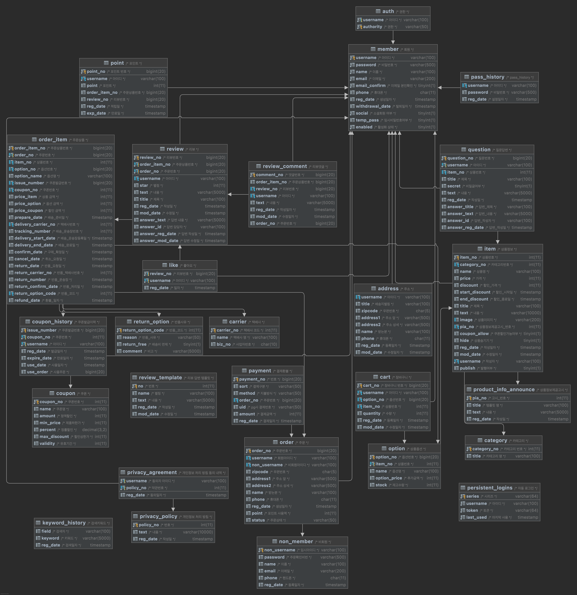

프로젝트를 진행하면서 가장 찾기 어려웠던 자료가 DB 구조에 대한 부분이었다. 정답이 명확하지도 않거니와 실제 서비스라면 핵심적인 로직이 드러날 수도 있는 부분이라 자료가 크게 없지 않을까 개인적으로 생각해보았다. 그리고 DB를 구현하기 위해서 Flow가 선행되어야 함을 느꼈고 두 과정을 병행하여 진행했던 기억이 있다.

## 1. DB

초기부터 제품 교환에 대한 부분은 고려하지 않았고 논리적인 오류는 그때그때 수정하여 나온 결과지만 여기저기 미흡한 부분이 있을 수 있다.

### 1-1. ERD



### 1-2.DDL

```sql
-- project
DROP SCHEMA IF EXISTS `project`;

-- project
CREATE SCHEMA `project`;

USE `project`;

CREATE TABLE carrier
(
    carrier_no int AUTO_INCREMENT COMMENT '택배사 코드'
        PRIMARY KEY,
    name       varchar(100) NULL COMMENT '택배사 명',
    biz_no     char(10)     NULL COMMENT '사업자번호'
)
    COMMENT '택배사';

CREATE TABLE category
(
    category_no int AUTO_INCREMENT COMMENT '카테고리 번호'
        PRIMARY KEY,
    title       varchar(100) NULL COMMENT '카테고리 명'
)
    COMMENT '카테고리';

CREATE TABLE coupon
(
    coupon_no    int AUTO_INCREMENT COMMENT '쿠폰번호'
        PRIMARY KEY,
    name         varchar(100)  NULL COMMENT '쿠폰명',
    amount       int           NULL COMMENT '정액할인',
    min_price    int           NULL COMMENT '제품하한가',
    percent      decimal(3, 2) NULL COMMENT '정률할인',
    max_discount int           NULL COMMENT '할인상한가',
    validity     int           NULL COMMENT '유효기간'
)
    COMMENT '쿠폰';

CREATE TABLE keyword_history
(
    field    varchar(100)  NULL COMMENT '검색자',
    keyword  varchar(5000) NULL COMMENT '키워드',
    reg_date timestamp     NULL COMMENT '검색일자'
)
    COMMENT '검색키워드';

CREATE TABLE member
(
    username       varchar(100)                         NOT NULL COMMENT '아이디'
        PRIMARY KEY,
    password        varchar(500)                        NOT NULL COMMENT '비밀번호',
    name            varchar(100)                        NOT NULL COMMENT '이름',
    email           varchar(200)                        NOT NULL COMMENT '이메일',
    email_confirm   tinyint(1) DEFAULT '0'              NOT NULL COMMENT '이메일 본인확인',
    phone           char(11)                            NULL COMMENT '휴대폰',
    reg_date        timestamp DEFAULT CURRENT_TIMESTAMP NULL COMMENT '생성일자',
    withdrawal_date timestamp                           NULL COMMENT '탈퇴일자',
    social          tinyint(1)                          NOT NULL COMMENT '소셜회원 여부',
    temp_pass       tinyint(1) DEFAULT '0'              NULL COMMENT '임시비밀번호여부',
    enabled         tinyint(1) DEFAULT '1'              NOT NULL COMMENT '활성화 상태'
)
    COMMENT '회원';

CREATE TABLE auth
(
    username        varchar(100)                        NOT NULL COMMENT '아이디',
    authority       varchar(50)                         NOT NULL COMMENT '권한',
    PRIMARY KEY (username, authority),
    CONSTRAINT fk_member_to_auth
        FOREIGN KEY (username) REFERENCES member (username)
)
    COMMENT '권한';

CREATE TABLE persistent_logins
(
    username        varchar(100)                        NOT NULL COMMENT '아이디',
    series       varchar(64)                         NOT NULL COMMENT '시리즈'
        PRIMARY KEY,
    token       varchar(64)                         NOT NULL COMMENT '토큰',
    last_used       timestamp                        NOT NULL COMMENT '마지막 사용'
)
    COMMENT '자동 로그인';

CREATE TABLE address
(
    username varchar(100)                        NULL COMMENT '아이디',
    title     varchar(100)                        NULL COMMENT '배송지별칭',
    zipcode   char(5)                             NULL COMMENT '우편번호',
    address1  varchar(500)                        NULL COMMENT '주소 앞',
    address2  varchar(500)                        NULL COMMENT '주소 상세',
    name      varchar(100)                        NULL COMMENT '받는분',
    phone     char(11)                            NULL COMMENT '휴대폰',
    reg_date  timestamp DEFAULT CURRENT_TIMESTAMP NULL COMMENT '등록일자',
    mod_date  timestamp                           NULL ON UPDATE CURRENT_TIMESTAMP COMMENT '수정일자',
    CONSTRAINT fk_member_to_address
        FOREIGN KEY (username) REFERENCES member (username)
)
    COMMENT '주소';

CREATE TABLE coupon_history
(
    issue_number bigint AUTO_INCREMENT COMMENT '쿠폰발급번호',
    coupon_no    int                                 NOT NULL COMMENT '쿠폰번호',
    username    varchar(100)                        NOT NULL COMMENT '아이디',
    reg_date     timestamp DEFAULT CURRENT_TIMESTAMP NULL COMMENT '발급일자',
    expire_date  timestamp                           NULL COMMENT '만료일자',
    use_date     timestamp                           NULL COMMENT '사용일자',
    use_order    bigint                              NULL COMMENT '사용주문',
    PRIMARY KEY (issue_number, coupon_no, username),
    CONSTRAINT fk_coupon_to_coupon_history
        FOREIGN KEY (coupon_no) REFERENCES coupon (coupon_no),
    CONSTRAINT fk_member_to_coupon_history
        FOREIGN KEY (username) REFERENCES member (username)
)
    COMMENT '쿠폰발급이력';

CREATE TABLE non_member
(
    non_username varchar(100)                        NOT NULL COMMENT '임시아이디'
        PRIMARY KEY,
    password      varchar(500)                        NULL COMMENT '주문확인비번',
    name          varchar(100)                        NULL COMMENT '이름',
    email         varchar(200)                        NULL COMMENT '이메일',
    phone         char(11)                            NULL COMMENT '핸드폰',
    reg_date      timestamp DEFAULT CURRENT_TIMESTAMP NULL COMMENT '등록일자'
)
    COMMENT '비회원';

CREATE TABLE `order`
(
    order_no      bigint                              NOT NULL COMMENT '주문번호'
        PRIMARY KEY,
    username     varchar(100)                        NULL COMMENT '회원아이디',
    non_username varchar(100)                        NULL COMMENT '비회원아이디',
    zipcode       char(5)                             NULL COMMENT '우편번호',
    address1      varchar(500)                        NULL COMMENT '주소 앞',
    address2      varchar(500)                        NULL COMMENT '주소 상세',
    name          varchar(100)                        NULL COMMENT '받는분',
    phone         char(11)                            NULL COMMENT '휴대폰',
    reg_date      timestamp DEFAULT CURRENT_TIMESTAMP NULL COMMENT '생성일자',
    point         int                                 NULL COMMENT '포인트 사용액',
    status        varchar(50)                         NULL COMMENT '주문상태',
    CONSTRAINT fk_member_to_order
        FOREIGN KEY (username) REFERENCES member (username),
    CONSTRAINT fk_non_member_to_order
        FOREIGN KEY (non_username) REFERENCES non_member (non_username)
)
    COMMENT '주문';

CREATE TABLE pass_history
(
    username varchar(100)                        NULL COMMENT '아이디',
    password  varchar(500)                        NULL COMMENT '비밀번호',
    reg_date  timestamp DEFAULT CURRENT_TIMESTAMP NULL COMMENT '설정일자',
    CONSTRAINT fk_member_to_pass_history
        FOREIGN KEY (username) REFERENCES member (username)
)
    COMMENT 'pass_history';

CREATE TABLE payment
(
    payment_no bigint AUTO_INCREMENT COMMENT '번호'
        PRIMARY KEY,
    sort       varchar(50)                         NULL COMMENT '결제구분',
    method     varchar(50)                         NULL COMMENT '지불방식',
    order_no   bigint                              NULL COMMENT '주문번호',
    uid        varchar(50)                         NULL COMMENT 'pg사 결제번호',
    amount     int                                 NULL COMMENT '결제금액',
    reg_date   timestamp DEFAULT CURRENT_TIMESTAMP NULL COMMENT '결제일자',
    CONSTRAINT fk_order_to_payment
        FOREIGN KEY (order_no) REFERENCES `order` (order_no)
)
    COMMENT '결제환불';

CREATE TABLE point
(
    point_no  bigint AUTO_INCREMENT COMMENT '포인트 번호'
        PRIMARY KEY,
    username     varchar(100)                        NOT NULL COMMENT '아이디',
    point         int                                 NULL COMMENT '포인트',
    order_item_no bigint                              NULL COMMENT '주문상품번호',
    review_no     bigint                              NULL COMMENT '리뷰번호',
    reg_date      timestamp DEFAULT CURRENT_TIMESTAMP NULL COMMENT '적립일',
    exp_date      timestamp                           NULL COMMENT '만료일',
    CONSTRAINT fk_member_to_point
        FOREIGN KEY (username) REFERENCES member (username)
)
    COMMENT '포인트';

CREATE TABLE privacy_policy
(
    policy_no       int AUTO_INCREMENT COMMENT '번호'
        PRIMARY KEY,
    text     varchar(10000)                      NULL COMMENT '내용',
    reg_date timestamp DEFAULT CURRENT_TIMESTAMP NULL COMMENT '작성일'
)
    COMMENT '개인정보 처리 방침';

CREATE table privacy_agreement
(
    username   varchar(100)                        NOT NULL COMMENT '동의자 아이디',
    policy_no   int                                 NOT NULL COMMENT '약관번호',
    reg_date    timestamp DEFAULT CURRENT_TIMESTAMP NULL COMMENT '동의일자',
    PRIMARY KEY (username, policy_no),
    CONSTRAINT fk_member_to_privacy_agreement
        FOREIGN KEY (username) REFERENCES member (username),
    CONSTRAINT fk_privacy_policy_to_privacy_agreement
        FOREIGN KEY (policy_no) REFERENCES privacy_policy (policy_no)
)
    COMMENT '개인정보 처리 방침 동의 내역';

CREATE TABLE product_info_announce
(
    pia_no   int AUTO_INCREMENT COMMENT '고시_번호'
        PRIMARY KEY,
    title    varchar(100)                        NULL COMMENT '템플릿 명',
    text     varchar(5000)                       NULL COMMENT '내용',
    reg_date timestamp DEFAULT CURRENT_TIMESTAMP NULL COMMENT '작성일'
)
    COMMENT '상품정보제공고시';

CREATE TABLE item
(
    item_no        int AUTO_INCREMENT COMMENT '상품번호'
        PRIMARY KEY,
    category_no    int            NULL COMMENT '카테고리번호',
    name           varchar(100)   NULL COMMENT '상품명',
    price          int            NULL COMMENT '가격',
    discount       int            NULL COMMENT '할인_가격',
    start_discount timestamp      NULL COMMENT '할인_시작일',
    end_discount   timestamp      NULL COMMENT '할인_종료일',
    title          varchar(100)   NULL COMMENT '제목',
    text           varchar(10000) NULL COMMENT '내용',
    image          varchar(200)  NULL UNIQUE COMMENT '상품이미지',
    pia_no         int            NULL COMMENT '상품정보제공고시_번호',
    coupon_allow   tinyint(1)     NULL COMMENT '쿠폰할인가능여부',
    hide           tinyint(1)     NULL COMMENT '상품숨기기',
    reg_date       timestamp DEFAULT CURRENT_TIMESTAMP NULL COMMENT '작성일자',
    mod_date       timestamp      NULL ON UPDATE CURRENT_TIMESTAMP COMMENT '수정일자',
    username       varchar(100)   NOT NULL COMMENT '작성자',
    publish        tinyint(1)     NULL COMMENT '발행여부',
    CONSTRAINT fk_category_to_item
        FOREIGN KEY (category_no) REFERENCES category (category_no)
            ON UPDATE CASCADE,
    CONSTRAINT fk_product_info_announce_to_item
        FOREIGN KEY (pia_no) REFERENCES product_info_announce (pia_no)
            ON UPDATE CASCADE,
    CONSTRAINT fk_member_to_item
        FOREIGN KEY (username) REFERENCES member (username)
)
    COMMENT '상품정보';

CREATE TABLE `option`
(
    option_no    bigint AUTO_INCREMENT COMMENT '옵션번호',
    item_no      int          NOT NULL COMMENT '상품번호',
    name         varchar(100) NULL COMMENT '옵션명',
    option_price int          NULL COMMENT '추가금액',
    stock        int          NULL COMMENT '재고수량',
    PRIMARY KEY (option_no, item_no),
    CONSTRAINT fk_item_to_option
        FOREIGN KEY (item_no) REFERENCES item (item_no)
            ON UPDATE CASCADE
            ON DELETE CASCADE
)
    COMMENT '상품옵션';

CREATE TABLE cart
(
    cart_no  bigint AUTO_INCREMENT COMMENT '장바구니 번호'
        PRIMARY KEY,
    username   varchar(100)                        NOT NULL COMMENT '아이디',
    option_no   bigint                              NULL COMMENT '옵션번호',
    item_no     int                                 NULL COMMENT '상품번호',
    quantity    int                                 NULL COMMENT '수량',
    reg_date    timestamp DEFAULT CURRENT_TIMESTAMP NULL COMMENT '등록일자',
    mod_date    timestamp                           NULL ON UPDATE CURRENT_TIMESTAMP COMMENT '수정일자',
    CONSTRAINT fk_member_to_cart
        FOREIGN KEY (username) REFERENCES member (username),
    CONSTRAINT fk_option_to_cart
        FOREIGN KEY (option_no, item_no) REFERENCES `option` (option_no, item_no)
            ON DELETE CASCADE
            ON UPDATE CASCADE
)
    COMMENT '장바구니';

CREATE TABLE question
(
    question_no     bigint AUTO_INCREMENT COMMENT '질문번호',
    username       varchar(100)                        NOT NULL COMMENT '아이디',
    item_no         int                                 NULL COMMENT '상품번호',
    title           varchar(100)                        NULL COMMENT '제목',
    secret          tinyint(1)                          NULL COMMENT '비밀글여부',
    text            varchar(5000)                       NULL COMMENT '내용',
    reg_date        timestamp DEFAULT CURRENT_TIMESTAMP NULL COMMENT '작성일',
    answer_title    varchar(100)                        NULL COMMENT '답변_제목',
    answer_text     varchar(5000)                       NULL COMMENT '답변_내용',
    answer_id       varchar(100)                        NULL COMMENT '답변_작성자',
    answer_reg_date timestamp                           NULL COMMENT '답변_작성일',
    PRIMARY KEY (question_no, username),
    CONSTRAINT fk_item_to_question
        FOREIGN KEY (item_no) REFERENCES item (item_no)
            ON UPDATE CASCADE
            ON DELETE SET NULL,
    CONSTRAINT fk_member_to_question
        FOREIGN KEY (username) REFERENCES member (username)
)
    COMMENT '질문답변';

CREATE TABLE return_option
(
    return_option_code int AUTO_INCREMENT COMMENT '반품_코드'
        PRIMARY KEY,
    reason             varchar(50)   NULL COMMENT '반품_사유',
    return_free        tinyint(1)    NULL COMMENT '배송비 면제',
    comment            varchar(5000) NULL COMMENT '비고'
)
    COMMENT '반품사유';

CREATE TABLE order_item
(
    order_item_no       bigint AUTO_INCREMENT COMMENT '주문상품번호',
    order_no            bigint    NOT NULL COMMENT '주문번호',
    item_no             int       NULL COMMENT '상품번호',
    option_no           bigint    NULL COMMENT '옵션번호',
    option_name         varchar(100)    NULL COMMENT '옵션명',
    issue_number        bigint    NULL COMMENT '쿠폰발급번호',
    coupon_no           int       NULL COMMENT '쿠폰번호',
    price_item          int       NULL COMMENT '상품 금액',
    price_option        int       NULL COMMENT '옵션 금액',
    price_coupon        int       NULL COMMENT '할인 금액',
    prepare_date        timestamp NULL COMMENT '배송_준비일',
    delivery_carrier_no int       NULL COMMENT '택배사번호',
    tracking_number     int       NULL COMMENT '배송_운송장번호',
    delivery_start_date timestamp NULL COMMENT '배송_운송장등록일',
    delivery_end_date   timestamp NULL COMMENT '배송_완료일',
    confirm_date        timestamp NULL COMMENT '구매_확정일',
    cancel_date         timestamp NULL COMMENT '취소_요청일',
    return_date         timestamp NULL COMMENT '반품_요청일',
    return_carrier_no   int       NULL COMMENT '반품_택배사번호',
    return_number       timestamp NULL COMMENT '반품_운송장',
    return_confirm_date timestamp NULL COMMENT '반품_처리일',
    return_option_code  int       NULL COMMENT '반품_코드',
    refund_date         timestamp NULL COMMENT '환불_일자',
    PRIMARY KEY (order_item_no, order_no),
    CONSTRAINT fk_carrier_to_order_item
        FOREIGN KEY (delivery_carrier_no) REFERENCES carrier (carrier_no)
            ON UPDATE CASCADE,
    CONSTRAINT fk_coupon_history_to_order_item
        FOREIGN KEY (issue_number, coupon_no) REFERENCES coupon_history (issue_number, coupon_no)
            ON UPDATE CASCADE,
    CONSTRAINT fk_option_to_order_item
        FOREIGN KEY (option_no, item_no) REFERENCES `option` (option_no, item_no)
            ON UPDATE CASCADE
            ON DELETE SET NULL,
    CONSTRAINT fk_order_to_order_item
        FOREIGN KEY (order_no) REFERENCES `order` (order_no)
            ON UPDATE CASCADE,
    CONSTRAINT fk_return_option_to_order_item
        FOREIGN KEY (return_option_code) REFERENCES return_option (return_option_code)
            ON UPDATE CASCADE
)
    COMMENT '주문상품';

CREATE TABLE review
(
    review_no       bigint AUTO_INCREMENT COMMENT '리뷰번호',
    order_item_no   bigint                              NOT NULL COMMENT '주문상품번호',
    order_no        bigint                              NOT NULL COMMENT '주문번호',
    username       varchar(100)                        NULL COMMENT '아이디',
    star            int                                 NULL COMMENT '별점',
    text            varchar(5000)                       NULL COMMENT '내용',
    title           varchar(100)                        NULL COMMENT '제목',
    reg_date        timestamp DEFAULT CURRENT_TIMESTAMP NULL COMMENT '작성일',
    mod_date        timestamp                           NULL ON UPDATE CURRENT_TIMESTAMP COMMENT '수정일',
    answer_text     varchar(5000)                       NULL COMMENT '답변 내용',
    answer_id       varchar(100)                        NULL COMMENT '답변 담당자',
    answer_reg_date timestamp                           NULL COMMENT '답변 작성일',
    answer_mod_date timestamp                           NULL COMMENT '답변 수정일',
    PRIMARY KEY (review_no, order_item_no, order_no),
    CONSTRAINT fk_member_to_review
        FOREIGN KEY (username) REFERENCES member (username),
    CONSTRAINT fk_order_item_to_review
        FOREIGN KEY (order_item_no, order_no) REFERENCES order_item (order_item_no, order_no)
)
    COMMENT '리뷰';

CREATE TABLE `like`
(
    review_no bigint       NOT NULL COMMENT '리뷰번호',
    username varchar(100) NOT NULL COMMENT '아이디',
    reg_date  timestamp    NULL COMMENT '일자',
    PRIMARY KEY (review_no, username),
    CONSTRAINT fk_member_to_like
        FOREIGN KEY (username) REFERENCES member (username),
    CONSTRAINT fk_review_to_like
        FOREIGN KEY (review_no) REFERENCES review (review_no)
            ON UPDATE CASCADE
            ON DELETE CASCADE
)
    COMMENT '좋아요';

CREATE TABLE review_comment
(
    comment_no    bigint AUTO_INCREMENT COMMENT '댓글번호'
        PRIMARY KEY,
    order_item_no bigint                              NULL COMMENT '주문상품번호',
    review_no     bigint                              NULL COMMENT '리뷰번호',
    username      varchar(100)                        NULL COMMENT '아이디',
    text          varchar(5000)                       NULL COMMENT '내용',
    reg_date      timestamp DEFAULT CURRENT_TIMESTAMP NULL COMMENT '작성일자',
    mod_date      timestamp                           NULL ON UPDATE CURRENT_TIMESTAMP COMMENT '수정일자',
    order_no      bigint                              NULL COMMENT '주문번호',
    CONSTRAINT fk_member_to_review_comment
        FOREIGN KEY (username) REFERENCES member (username)
            ON UPDATE CASCADE
            ON DELETE CASCADE,
    CONSTRAINT fk_review_to_review_comment
        FOREIGN KEY (review_no) REFERENCES review (review_no)
)
    COMMENT '리뷰댓글';

CREATE TABLE review_template
(
    no       int AUTO_INCREMENT COMMENT '번호'
        PRIMARY KEY,
    name     varchar(100)                        NULL COMMENT '별칭',
    text     varchar(5000)                       NULL COMMENT '내용',
    reg_date timestamp DEFAULT CURRENT_TIMESTAMP NULL COMMENT '작성일',
    mod_date timestamp                           NULL ON UPDATE CURRENT_TIMESTAMP COMMENT '수정일'
)
    COMMENT '리뷰 답변 템플릿';
```