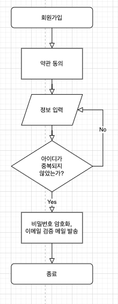
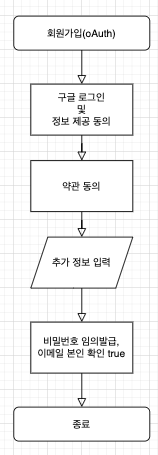
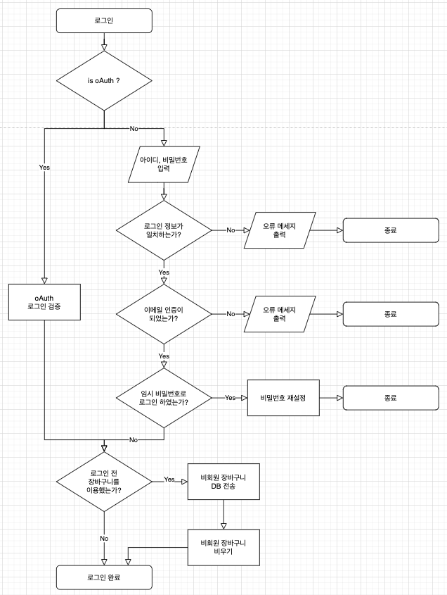

## 1. Flow

### 1-1. 회원가입

#### 1-1-1. 회원가입(일반)

#### 1-1-2. 회원가입(oAuth)

### 1-2. 로그인

### 1-3. 비밀번호 초기화(일반회원)

아이디 & 이메일 입력 → (server) 일치 확인 → (server) 임시 비밀번호 저장 및 메일 발송 → 로그인 시 비밀번호 변경 안내 띄우기

## 2. 구현 Idea

#### 회원가입(일반)

가입신청 → 약관 동의 → 정보입력 → 이메일 확인(~~session?~~ table) → 가입 완료

> 이메일 링크에 아이디를 암호화한 주소를 줘서 해당 주소로 접속하면 확인 되는 걸로 하기  
>   

#### 회원가입(oAuth)

가입신청 → 구글 로그인 및 정보 제공 동의 → (약관 동의) → 가입 완료

> 비밀번호는 암호화 모듈 이용해서 임의로 입력(어차피 미사용하지만 혹시 모를 상황 대비)  
oAuth 속성에 true 주기  
>   

### 1-4. 이메일 인증

링크형식 이메일 발송 → 승인 시 로그인 허용

이메일 인증

→ 아이디를 암호화한 url 경로를 발송
example.com/confirm-email/2%2dfe23fde234fde