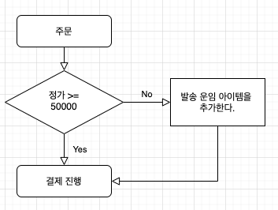

## 0. 전제 조건

- 배송비는 `발송 운임`과 `반송 운임`으로 구분하며, 상품과 동일하게 취급한다.
- 발송 운임은 주문 당 1개를 초과할 수 없다.
- 반송 운임은 경우에 따라 중복 부과될 수 있다.
- 배송비는 편도 2,500원 왕복 5,000원으로 책정한다.
- 정가기준 50,000원 이상 구매 시 발송 운임은 판매자가 부담한다.
- 취소 반품 시, 배송비 아이템은 제외하고 계산한다.
ex) 상품 A 10,000원 +  상품 B 15,000원 + 발송 운임 2,500원 = 합 27,500원
단순변심 반품 시 주문에 반송 운임 아이템 추가
운임 5,000원을 제외한 22,500원 환불

## 1. Flow

### 1-1. 주문

#### 1-1-1. 주문 발생

#### 1-1-2. 주문 수정

### 1-2. 취소

#### 1-2-1. 전체 취소

#### 1-2-2. 부분 취소

### 1-3. 반품

#### 1-3-1. 전체 반품

#### 1-3-2. 부분 반품

## 2. 구현 Idea

### 2-1. 배송비 부과 방식

- 상품 목록에 발송 운임, 반송 운임 항목을 추가한다.
- 발송-배송비는 결제 당시에 정가(할인 전 금액)를 합산하여 부과 여부를 결정하고
주문상품 리스트에 추가 또는 삭제한다.
- 부분-취소 또는 부분-반품이 발생할 경우 기초금액을 재환산하여 반품 금액을 산정한다.
배송비가 부과되어야 할 경우 주문상품에 배송비를 추가하고 차액 부분만 환불한다.(2500원 이하 제품이 있을경우 추가결제도 필요하다.)
- 제품 하자의 경우 배송비가 부과되지 않는다. (왕복)
- 하자있는 제품과 하자없는 제품을 일괄로 환불할 경우에도 배송비가 부과되지 않는다.

주의 - 여러 상품을 구매한 후 하자있는 상품을 반품하고, 이후에 하자없는 상품을 반품할 경우 배송비가 부과될 수 있는 문제 체크

## 기타

- 취소 반품 시 배송비 아이템을 삭제할 것인지 취소 일자를 남길 것인지 논의 필요