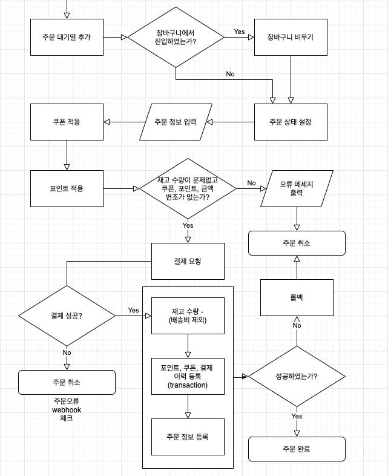

## 1. Flow

### 1-1. 주문하기

### 1-2. 주문 확인

## 2. 구현 Idea

### 2-1. 주문 대기열 삭제 주기

- 결제가 완료되지 않은 주문 대기열 매일 자정마다 삭제
(주문상품, 주문 릴레이션)
- 진행중인 주문이 삭제되는 경우 고려해야함
- 11시 55분에 작성한 주문 대기열이 바로 삭제되는 불상사도 고려해야함

→ 자정마다 2일 이상 지난 미결제 대기열 삭제

### 2-2.  주문 진행 상태 구분

주문번호가 일치하는 각 주문상품들의 상태를 보고 판단

- 결제 대기 - 주문 튜플은 있으나 결제 내역이 없다.
- 결제 완료 - 결제 내역만 있고 취소는 없다, 주문상품 총액과 결제 금액이 일치한다.
- 배송 준비중
- 배송중
- 배송 완료
- 주문 완료
- 주문 취소 - 결제 내역이 있으나 금액 합이 0이다.
- 반품 진행중
- 반품 완료

삭제 - 결제 내역이 없어야 삭제 가능
주문 대기열에서 취소를 눌렀거나, 조건으로 인하여 자동으로 삭제

### 2-3. 포인트 환불, 반품 배송비

### 2-4. 주문 확인 창 구성 안

### 2-5. 결제 관련

- client 단위에서 금액, 결제 상태, 포인트, 쿠폰 등을 임의로 조작하였는지 모듈을 작성하여 결제 전후로 체크가 필요
- 결제 구분(sort) - 결제, 취소
- 지불 방식(method) - 현금, 포인트

### 2-6. 그 외

- 결제 완료 시점에 재고 수량 빼기
- 취소 완료 시점에 수량 더하기
- 반품 완료는 재고 수량 체크 안함(수기 입력)

- 제품에 면세 구분 고려 안함
- 가격에 음수는 안 됨