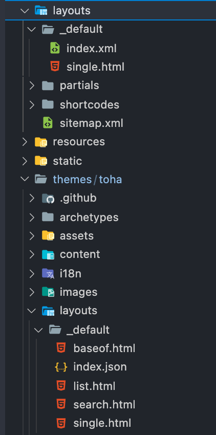

## 글 게시

작성한 글을 게시하려면 md 형식으로 저장하여 프로젝트 내부의 content 폴더에 위치시키면 된다.

### front matter 설정

글 상단에 yaml, toml, json 키 값 쌍으로 이워진 front matter 를 작성해야한다. front matter 는 종류가 꽤 다양해 공식 문서를 확인해보고 필요한 것들을 선택적으로 사용하면 될 듯하다. 그리고 적용한 테마에 따라서 필수적으로 요구되는 front matter 가 달라질 수 있고 형식 또한 달라질 수 있는 듯 하다.

[https://gohugo.io/content-management/front-matter/](https://gohugo.io/content-management/front-matter/)

### 섹션 설정

hugo는 폴더로 섹션과 하위 섹션을 구분할 수 있다. 거기에 맞춰 md 파일을 위치시키면 되고 기본적으로 content 폴더 이후 경로가 url이 된다. 이를 변경하려면 front matter 중 url 을 이용하면 된다. 사실 몇번을 읽어봐도 이해가 잘 되지않아 마찬가지로 공식문서 링크를 남긴다.

[https://gohugo.io/content-management/organization/](https://gohugo.io/content-management/organization/)

## 테마 설정

시중에 배포되어 있는 테마를 받아 적용하게 되면 경우에 따라 입맛대로 수정하고 싶은 욕구가 생길 수 있다. 그럴 때 pull 받은 테마를 바로 수정해도 반영이 되지만 가급적 루트 폴더에 사본을 만들어 해당 파일을 수정하여 사용하는 편이 유지보수 측면에서 유용하다.

예를들어 /themes/toha/layouts/single.html 파일을 수정하고 싶다면 루트폴더에 /layouts 경로를 만들어 파일을 복사하고 수정하여 쓰는 것이다.

빌드시에 적용한 테마의 파일과 루트 파일을 합치게 되는데, 동일한 파일이 있다면 루트 폴더의 파일을 우선적으로 사용하기 때문에 이같은 방식이 가능하다. (더 자세한 내용은 이 분 블로그 내용 [참고](https://ialy1595.github.io/post/blog-construct-2/)) 

처음엔 이 내용을 몰라서 submodule로 등록한 테마 디렉토리를 직접 수정해가며 '나중에 테마 업데이트가 있으면 이 부분을 어떻게 반영하지...?' 생각하고 있었다. 역시 무식하면 용감한듯하다. 덕분에 설정했던 내용을 다시 다 잡아주었다.

같은 맥락으로 여러개의 테마를 우선순위를 두어 적용도 가능한 듯 한데 도저히 엄두가 나질않아 포기했다. (관심 있으신 분들은 [여기](https://gohugo.io/hugo-modules/theme-components/)를 참고)

이 부분만 제대로 활용하면 테마 설정은 입맛대로 할 수 있다. (원래는 테마 설정하면서 여러 삽질 했던 기록들을 작성하려 했는데.. 오래되어 다 까먹어버렸다.)

## 참고

- [https://gohugo.io/hugo-modules/theme-components/](https://gohugo.io/hugo-modules/theme-components/)
- [https://ialy1595.github.io/post/blog-construct-2/](https://ialy1595.github.io/post/blog-construct-2/)