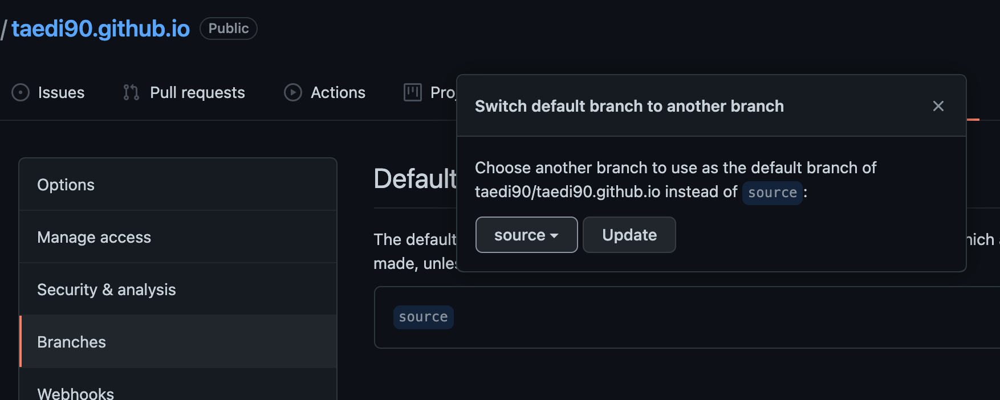
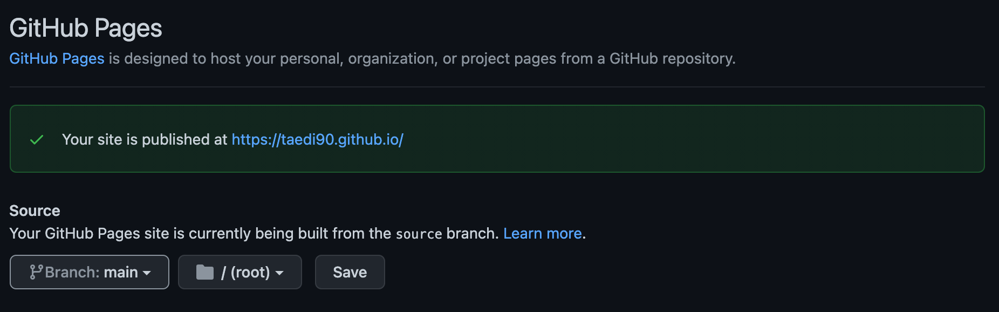
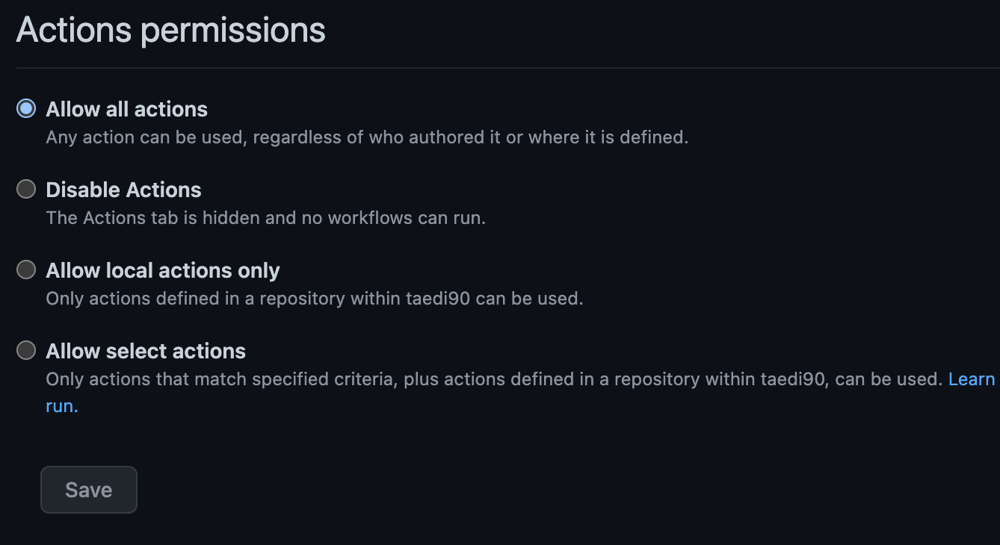
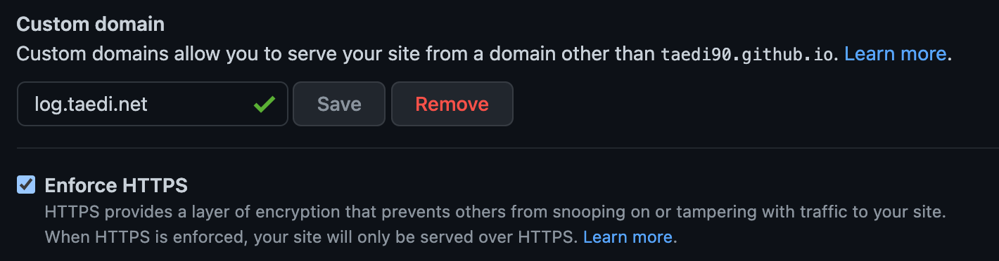
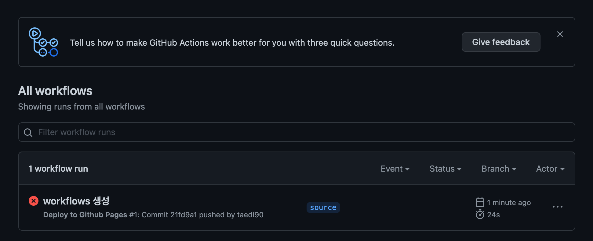
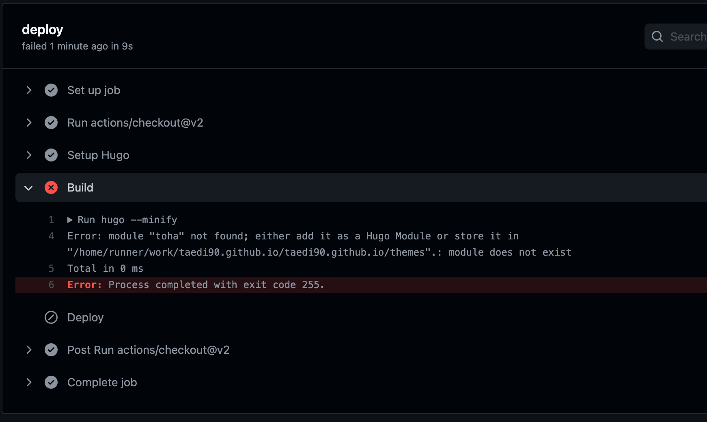
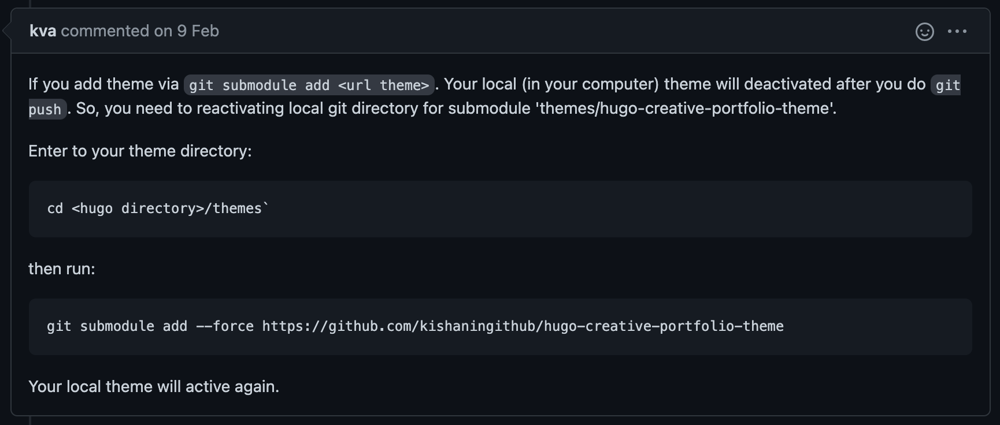
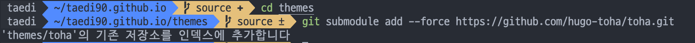
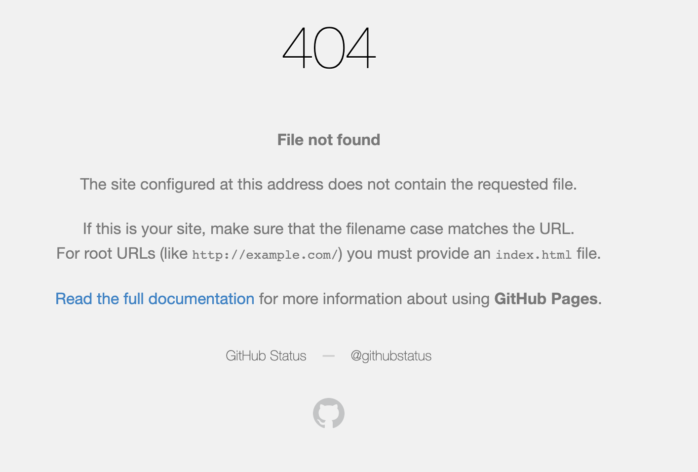
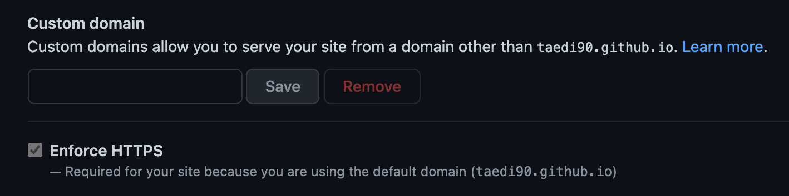

## 서론

어느정도 설정을 마쳤다면 마지막은 세팅한 블로그를 Github Pages 에 올리는 일만 남았다. Hugo는 자동빌드가 되지않아 push 만 하면 페이지가 업데이트되는 jekyll과는 조금 다르다고 한다.

그래서 전체 프로젝트 파일과 빌드 된 파일을 각각 저장할 공간이 필요한데 리포지토리를 각각 분리하여 구분하는 방식과 한개 리포지토리에 브랜치를 나누어 관리하는 방식이 있었다. 두가지 방법 모두 시도해보았는데 개인적으로 리포지토리가 많으면 관리가 어렵다고 느껴 한개 리포지토리를 활용한 방법을 택했다.

## 진행순서

### 1. 리포지토리 생성

'자신의 아이디.github.io' 라는 이름의 리포지토리를 생성한다.

### 2. source 브랜치 생성

브랜치 이름은 상관없겠지만 참고한 사이트를 따라 source라는 이름으로 브랜치를 생성하여 주었다.

```bash
# create the source branch
$ git checkout -b source
# push the source branch into Github
$ git push origin source
```

### 3. Github 설정

settings > branches > default branch 를 'source' 브랜치로 설정



settings > pages > source 를 'main' 브랜치로 설정



settings > actions > actions permissions > allow all actions



(선택사항) 2차 도메인 설정



### 4. 프로젝트 폴더내 .github/workflow/deploy-site.yaml 파일 생성

```yaml
name: Deploy to Github Pages

on:
  push:
    branches:
      - source  # Set a branch to deploy
  pull_request:

jobs:
  deploy:
    runs-on: ubuntu-20.04
    steps:
      - uses: actions/checkout@v2
        with:
          submodules: true  # Fetch Hugo themes (true OR recursive)
          fetch-depth: 0    # Fetch all history for .GitInfo and .Lastmod

      - name: Setup Hugo
        uses: peaceiris/actions-hugo@v2
        with:
          hugo-version: 'latest'
          extended: true

      - name: Build
        run: hugo --minify

      - name: Deploy
        uses: peaceiris/actions-gh-pages@v3
        with:
          github_token: ${{ secrets.GITHUB_TOKEN }}
          publish_branch: main # if your main branch is `master` use that here.
          publish_dir: ./public
```

만약  2차 도메인을 사용한다면 아래 코드를 사용

```yaml
name: Deploy to Github Pages

on:
  push:
    branches:
      - source  # Set a branch to deploy
  pull_request:

jobs:
  deploy:
    runs-on: ubuntu-20.04
    steps:
      - uses: actions/checkout@v2
        with:
          submodules: true  # Fetch Hugo themes (true OR recursive)
          fetch-depth: 0    # Fetch all history for .GitInfo and .Lastmod

      - name: Setup Hugo
        uses: peaceiris/actions-hugo@v2
        with:
          hugo-version: 'latest'
          extended: true

      - name: Build
        run: hugo --minify

      - name: CNAME copy
        run: cp CNAME ./public

      - name: Deploy
        uses: peaceiris/actions-gh-pages@v3
        with:
          github_token: ${{ secrets.GITHUB_TOKEN }}
          publish_branch: main # if your main branch is `master` use that here.
          publish_dir: ./public
```

### 5. 배포

이제 source 브랜치에서 푸시하면 자동으로 배포된다.

### 기타. 오류 해결 (삽질기)

#### 푸시 이후 설정한 action이 제대로 실행되지 않는 문제



빌드에서 오류가 난다...



구글링 중에 찾은 내용으로 정확히 이해는 못했지만 서브모듈을 다시 인덱싱 해주라는 내용인듯





하지만 오류가 멈추질 않는다..



deploy-site.yaml 에서  if: github.ref == 'refs/heads/main' 를 지워본다. (위의 코드에서는 이미 지워져있음)

해결!

#### deploy 시에 custom domain 이 초기화 되어버리는 현상



custiom domain 을 다시 설정한 뒤 main 리포지토리에 생성 된 CNAME 파일을 받아 프로젝트 루트 디렉토리에 복사, 그리고 아래 코드를 deploy-site.yaml 에 추가

```yaml
- name: CNAME copy
        run: cp CNAME ./public
```

해결!

### 참고

- [https://toha-guides.netlify.app/posts/getting-started/github-pages/](https://toha-guides.netlify.app/posts/getting-started/github-pages/)
- [https://gohugo.io/hosting-and-deployment/hosting-on-github/](https://gohugo.io/hosting-and-deployment/hosting-on-github/)