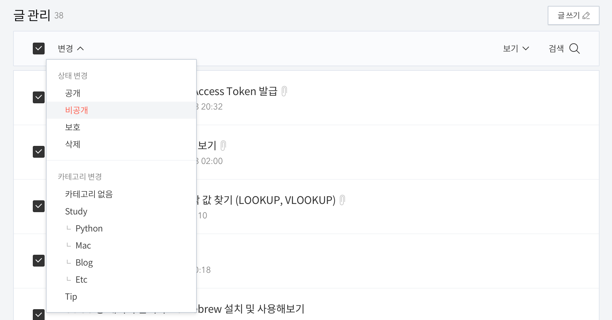
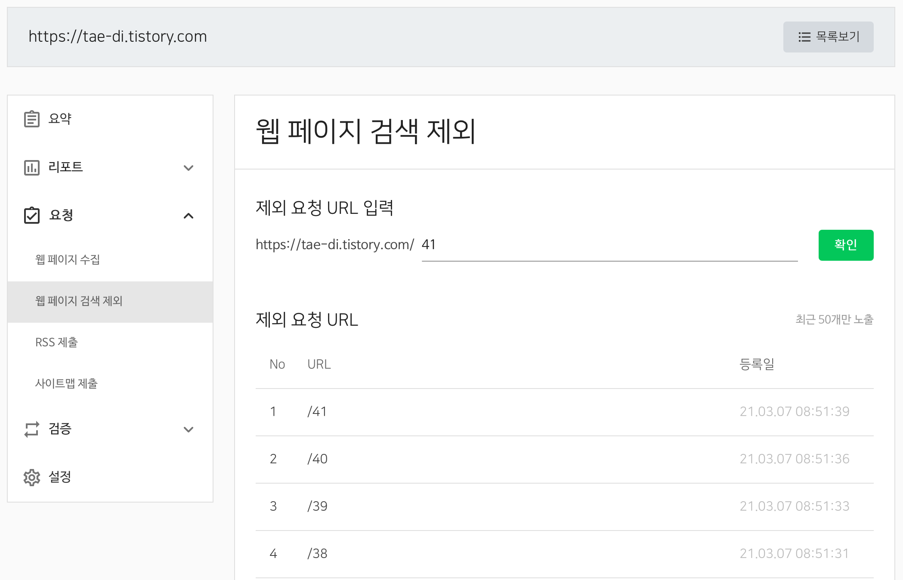
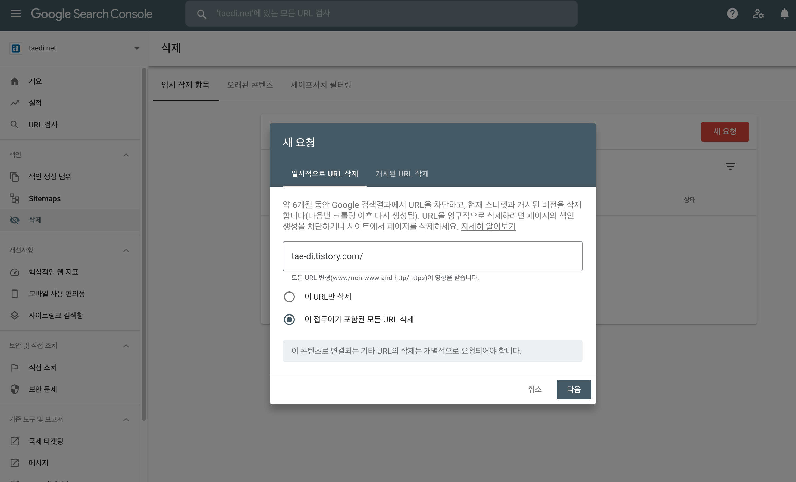
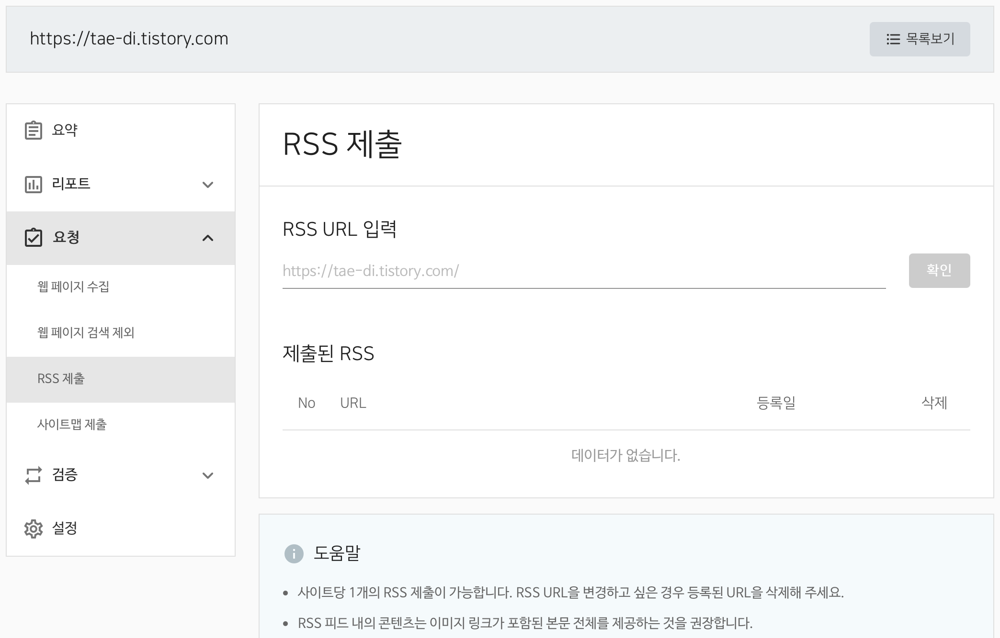
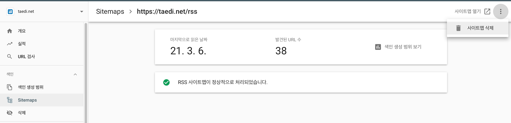
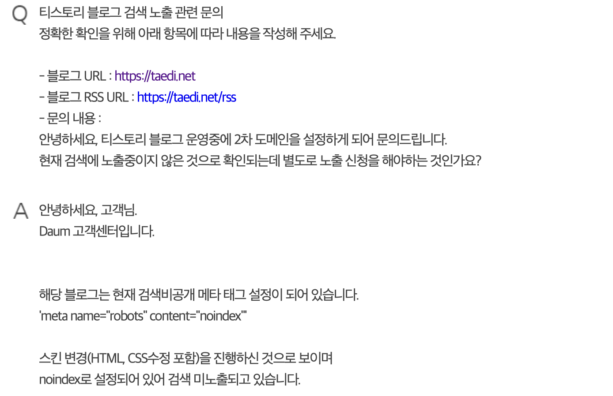
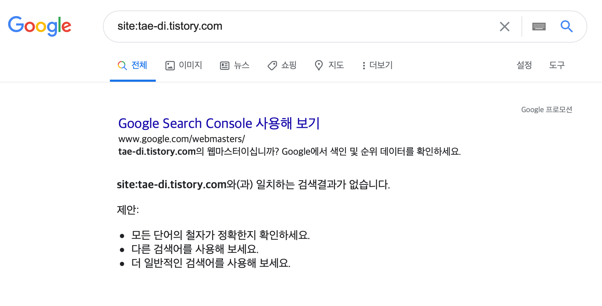
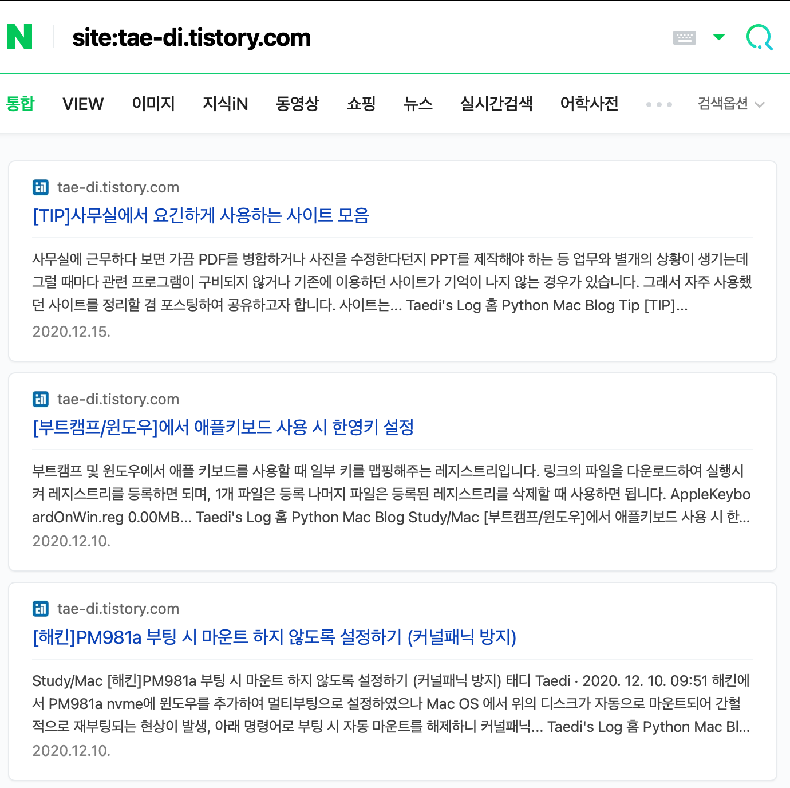
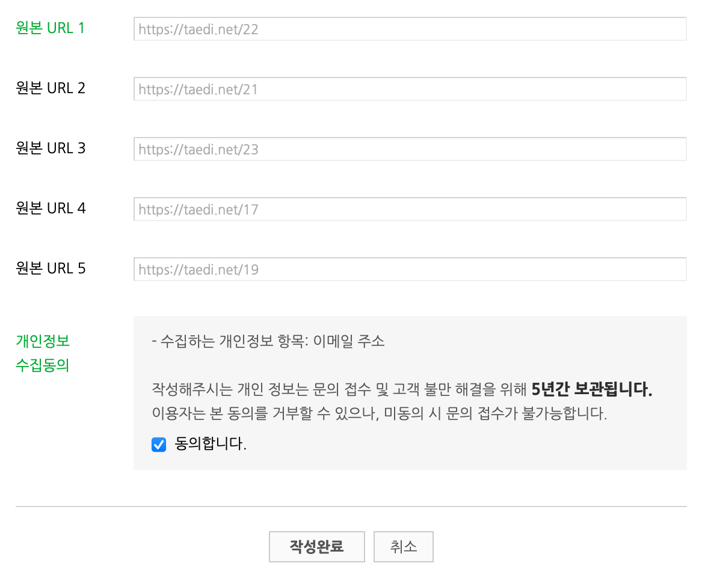

※ 티스토리 블로그에 작성했던 내용을 옮겨왔습니다.

티스토리 블로그 주소 변경을 마친 후에 가장 먼저 **사이트 검색노출**을 재설정 해주었습니다. 기존에 사용하던 1차 도메인(티스토리 기본 제공 도메인)이 계속해서 검색엔진에 노출되고 있고 2차 도메인(개인 도메인)은 아직 알려져있지 않기 때문에 신속하게 변경하여야 유입 방문객 수 손실을 그나마 낮출 수 있을 것이라 판단했기 때문입니다. 

도메인 구매과정 및 티스토리 블로그 적용 방법에 대한 내용이 궁금하시다면 아래 링크를 참고하시기 바랍니다.

[티스토리 개인 도메인 구매 및 활용하기 - #1 구매동기, DNS설정, 오류해결](https://taedi.net/41)

### 1차 도메인 게시글 검색엔진 노출 제외

일단 기존 주소로 알려져 있는 검색 노출을 모두 제외 시켜야합니다. 색인 요청 처리까지 긴 시간이 걸린 결과물이지만.. 새로운 도메인의 게시글과 중복글으로 판단되어 사이트 평가가 낮아질 수 있다는 우려에 우선적으로 진행하였습니다.

#### 내 블로그 글 비공개로 전환

우선 **블로그 관리 홈 >  글 관리** 탭에서 포스팅한 모든 글을 비공개로 처리해줍니다.  



블로그 관리 홈 > 글 관리에서 작성했던 모든 글을 비공개 처리한다.

#### 검색 등록기관에서 검색 제외 요청하기

네이버 서치어드바이저, 구글 서치콘솔, 빙 웹마스터 도구에서 현재 색인된 페이지들을 모두 검색 제외 요청합니다. 



네이버는 각각의 페이지를 모두 제외 요청 해야 함



구글은 도메인만 입력하면 하위 페이지를 모두 처리할 수 있다.

#### 제출한 RSS 및 사이트맵 제거

등록했던 RSS 및 사이트맵도 제거하여 검색엔진이 새로 페이지들을 색인하는 것을 방지하여 줍니다.



네이버 RSS 제출 페이지



구글은 Sitemaps에서 RSS와 사이트맵을 제거

#### 로봇 차단

검색 로봇이 사이트에 접근할 수 없도록 메타태그나 Robots.txt를 수정하여 주어야 하는데, 저는 1차 도메인으로 접근하는 경우에 인덱싱이 불가하도록 스크립트를 **스킨편집**에서 추가하여 주었습니다.

```jsx
		<!-- robot 접근 선택적 허용 -->
		<script type="text/javascript">
			var currURL = location.hostname;
			if (currURL.match('tae-di.tistory.com')) {
				document.write('<meta name="NaverBot" content="noindex, nofollow" />'+ "<br>");
				document.write('<meta name="Yeti" content="noindex, nofollow" />'+ "<br>");
			}
			else {
				document.write('<meta name="NaverBot" content="All" />'+ "<br>");
				document.write('<meta name="NaverBot" content="index,follow" />'+ "<br>");
				document.write('<meta name="Yeti" content="All" />'+ "<br>");
				document.write('<meta name="Yeti" content="index,follow" />'+ "<br>");

			}
		</script>

```

[tae-di.tistory.com](https://taedi.net)으로 접근하는 요청에 대해서만 로봇 검색을 제외하는 메타태그를 페이지에 작성하라는 내용인데 이 부분은 제가 올바르게 했는지 의문이 드네요. 위의 코드를 추가하고 **다음포털**에서 1~2차 도메인 모두 검색 노출이 불가능했습니다. 고객센터에 문의 해보니 아래와 같은 답변을 얻었습니다.



다음은 주석 처리 된 메타 태그도 로봇 크롤링에 반영한다? 

 

의문인 부분은 이후에 해당 스크립트를 주석처리해도 해결이 되지 않았다는 점인데.. 현재는 제거해버린 상태입니다. 향후에도 [tae-di.tistory.com](https://taedi.net)로 진입하는 크롤링을 모두 거절하고 싶은데 이 부분은 좀 더 학습을 해야 가능할 것 같습니다.

1차 도메인 검색 제외를 위해서는 <head>와 </head> 사이에 아래 태그를 넣어주고 처리 이후 삭제하여주는 방법이 가장 확실하고 간결합니다. 까먹지말고 꼭 지워야 2차 도메인에서의 크롤링이 가능합니다.

```html
<meta name="robots" content="noindex, nofollow" />
```

#### 검색 제외 확인

**site:블로그주소**를 각 검색엔진에 입력해 노출되는 페이지를 확인할 수 있습니다. 위의 과정들이 제대로 진행되었다면 수시간 내에 아래와 같이 1차 도메인으로 조회되는 글이 사라져 있을 것입니다.



검색엔진에 더이상 노출되지 않는 1차 도메인

#### 블로그 글 공개 전환 및 로봇 차단 메타 태그 지우기

이제 블로그 글을 공개전환하고 로봇 차단을 위해 입력한 메타 태그 또한 지워주면 됩니다. 각 검색 엔진에 등록 된 사이트도 제거할까도 생각해봤지만 추후에 검색에 노출되거나 하는 상황에 대비해 일단은 남겨두는 편이 좋을 것 같습니다. 제 경우에는 네이버 검색에서 결과가 다시 노출되어 이후에 다시 사이트를 등록하여 주었습니다.



되살아나는 네이버 검색결과..

### 개인 도메인 검색엔진 등록하기

이후 새로운 도메인들을 각각의 검색엔진에 등록하여 주면 됩니다. 구글의 경우에는 **주소 변경** 기능도 있지만 제 경우에는 오류가 발생하여 그냥 신규 등록으로 진행하였습니다. 등록 방법에 대한 안내는 아래 링크를 참고하여 주시기 바랍니다.

[티스토리 블로그 네이버 검색 노출 방법 - NAVER Search Advisor](https://taedi.net/6)

[티스토리 블로그 구글 검색 노출 방법 - Google Search Console](https://taedi.net/7)

### 네이버 원본 반영 요청하기

항상 마지막까지 애먹이는 것은 네이버 검색 노출인 것 같습니다. 구글과 빙, 다음에서는 개인 도메인으로 정상적으로 노출되기 시작했지만 네이버는 아직 반영이 되지 않고 있어 이번엔 **원본 반영 요청**을 해보았습니다. 아래 링크를 타고 가시면 고객센터 원본 반영 요청 페이지가 나오는데 여기에 포스팅 url을 입력하여 주고 신청하여주면 됩니다.

[네이버 고객센터](https://help.naver.com/support/contents/contents.help?serviceNo=606&categoryNo=2018#)



네이버 원본 반영 요청, 제발 처리해주시길...!

블로그의 게시글 url을 한번에 가져오는 것은 아래 글의 내용을 참고하시면 좋을 것 같습니다.

[사이트맵에서 페이지 목록 파싱해보기](https://taedi.net/22)

저는 이렇게 **사이트 검색노출 설정**을 마쳤습니다. 물론 아직까지 네이버는 정상적으로 검색 노출이 되지 않는 상황이고 발견되지 않은 오류가 있을 수도 있으나 관련 된 내용은 경과에 따라 추가하도록 하겠습니다. 읽어주셔서 감사합니다