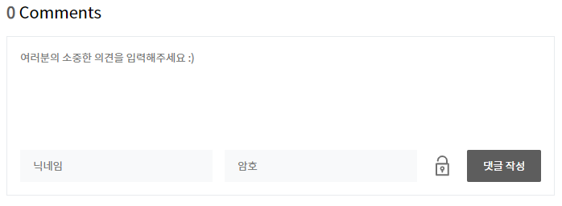
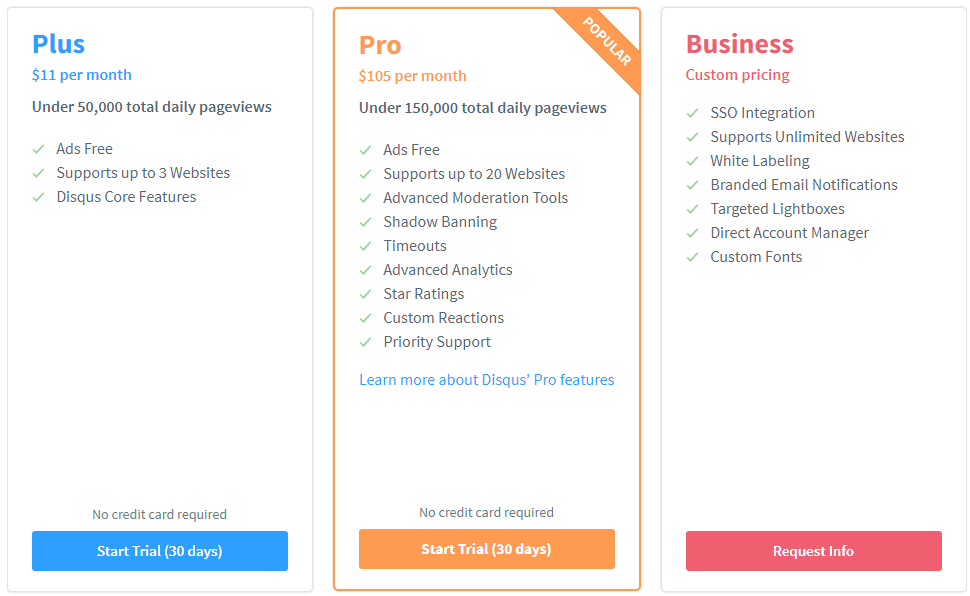
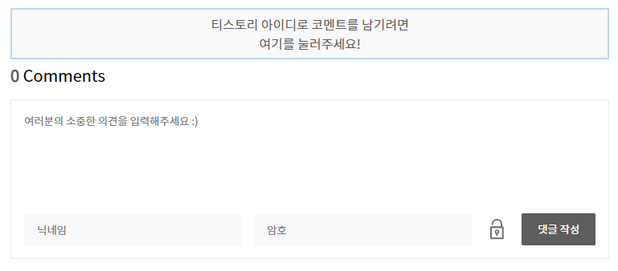

※ 티스토리 블로그에 작성했던 내용을 옮겨왔습니다.

개인 도메인으로 블로그 게시물에 접근하면 **티스토리 로그인이 되어있지 않은 상태**가 됩니다. 때문에 게시물 수정이나 블로그 관리 페이지 진입 등이 되지 않는 불편함이 있는데 이것은 블로그 주인만 느끼면 되는 문제라 크게 문제가 되지 않습니다. 하지만 **방문객이 겪는 불편함이 존재하는데** 바로 티스토리 로그인이 연동되지 않아 비회원으로 댓글을 남겨야 하는 문제입니다. 댓글기능이 원활하지 않는다는 것은 블로그의 순기능 중 소통의 영역에서 마이너스 요소가 아닐 수 없습니다.



개인 도메인에서는 티스토리 아이디로 댓글 작성이 불가능하다. 

그렇기때문에 이 문제를 완화할 수 있는 방법들을 몇가지 알아보았습니다. 

### Disqus 이용하기

Disqus 는 트위터, 페이스북, 구글 아이디를 사용해 댓글을 남길 수 있는 서비스 입니다. 사이트에 간단하게 코드만 삽입하는 방식으로 티스토리 아이디가 없는 분들도 본인의 SNS 아이디로 댓글을 남길 수 있는 플러그인을 장착할 수 있습니다. 하지만, 무료 사용의 경우 광고가 부착되며 개인이 사용하기에는 유료 요금제가 다소 부담스러운 느낌이 있어 선택을 포기하게 되었습니다.



광고를 제거하기 위해서는 한달에 커피 두잔 값을 지불해야한다.

[](https://disqus.com/)

### Facebook Comment Plugin 이용하기

페이스북에도 Disqus 와 비슷한 플러그인이 존재하며 제공받은 코드를 입력하는 것으로 간단하게 블로그에 댓글 플러그인을 설치할 수 있습니다. 하지만 개인적인 생각으로 주변에 페이스북을 사용하는 지인이 없어 오히려 이 방식이 독이 되지는 않을까 하는 생각이 들었습니다. 다만, 특별히 페이스북을 자주 활용하는 그룹이나 컨텐츠를 다루신다면 사용을 고려해봐도 좋을 것 같습니다.

[https://developers.facebook.com/docs/plugins/comments](https://developers.facebook.com/docs/plugins/comments)

### 1차 도메인으로 이동하는 링크 만들기

네 사실 제 블로그의 경우 댓글을 남겨주시는 분이 거의 없습니다. 이거나 저거나 비슷하다는 말이죠. 그렇기 때문에 위의 플러그인을 설치하여 사이트 반응속도를 늦추면서까지 해결책을 찾을 필요는 없다고 생각했고, 티스토리 아이디로 댓글을 작성하길 희망하시는 하시는 분들에게만 방법을 제시하여 드리는 것으로 충분하다 판단했습니다. 이에 대한 방법으로 몇몇분들이 블로그 하단에 1차 도메인으로 이동하는 링크를 마련해 두신 것을 참고하였고 원조가 어느분인지 몰라 링크 대신 직접 코드를 작성해 보았습니다. 스킨 편집에서 적당한 위치를 골라 아래 코드를 추가하시면 됩니다. 

- html

```html
<!-- 블로그 주소는 변경해서 쓰세요 -->
<div id="login-guide" onclick="javascript:location.href='https://tae-di.tistory.com'+document.location.pathname+'#login-guide'">
	<p>티스토리 아이디로 코멘트를 남기려면</p>
	<p>여기를 눌러주세요!</p>
</div>
```

- css

```css
#login-guide {
	text-align: center;
	border: 2px solid #BDD7EE;
	background: #F8F9FA;
	padding: 6px 0;
	margin: 5px 0;
	color: #5D5D5D;
}
```

스킨 편집에서 올바르게 입력을 하고 나면 아래와 같이 1차 도메인으로 이동할 수 있는 요소가 추가 된 것을 확인하실 수 있습니다.



1차 도메인으로 이동하는 요소 추가

개인 도메인을 설정하고 댓글로 고통받으시는 분에게 위의 방편들이 도움이 되기를 바랍니다.

읽어주셔서 감사합니다. :)