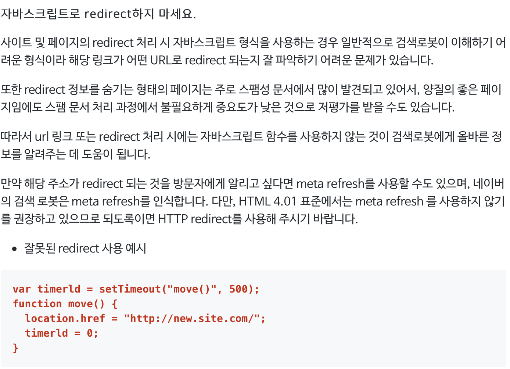
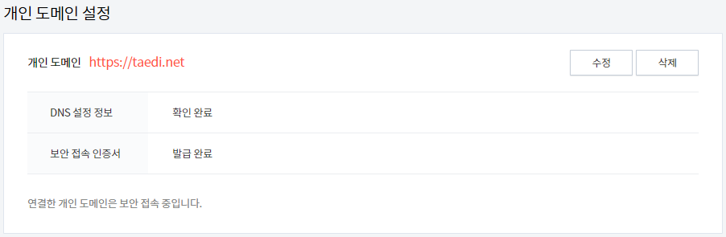
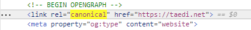
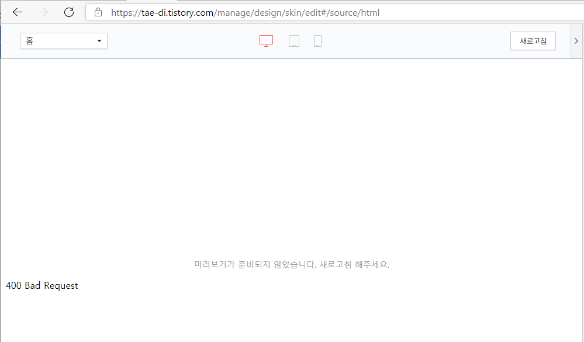
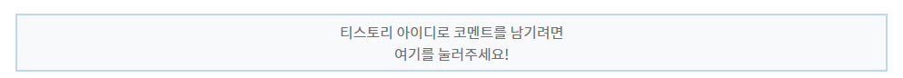
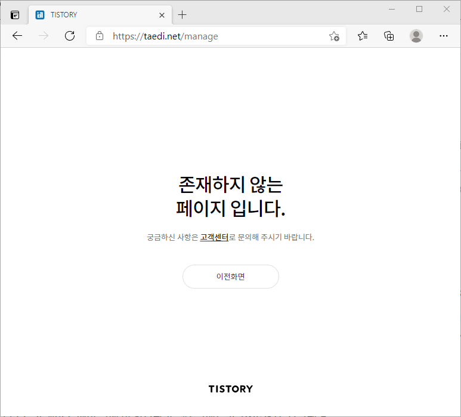

※ 티스토리 블로그에 작성했던 내용을 옮겨왔습니다.

티스토리 개인 도메인 추가 후 티스토리 기존 주소로 유입되는 방문객을 개인 도메인 주소로 이동하는 스크립트를 추가하여 보았습니다. 필수적인 사항은 아니지만 저의 경우 루트 도메인 [taedi.net](http://taedi.net) 을 블로그에 연결했기 때문에 [www.taedi.net](http://www.taedi.net) 과 [tae-di.tistory.com](http://tae-di.tistory.com) 총 세개의 도메인을 통해 블로그에 접속할 수 있었고, 깔끔한 교통정리를 위해 redirect를 활용하여 taedi.net 으로 단일화 시켰습니다. 

### 도메인을 통일해줘야 하는 몇가지 이유

- 방문통계에서 게시글이 주소에 따라 다르게 집계되는 문제
- 애드센스를 활용할 경우, 접속 도메인에 따라 광고가 나오지 않을 수 있는 문제점
- 주소를 하나로 통일해야 할 것 같은 강박

도메인이 여러개 존재하여 발생할 수 있는 불편함은 다음과 같습니다. 저에게는 3번 마음의 문제가 가장 컸고 블로그를 방문해주는 모든 분들에게 제가 구매한 도메인을 알리고? 싶었습니다.

### 문제점 1 - SEO 저평가 가능성 존재

자바스크립트를 활용한 redirect은 SEO에 좋지 않은 평가를 받을 수 있다고 합니다. **네이버 웹마스터 가이드**에서는 자바스크립트를 활용한 redirect는 검색로봇이 이해하기 어려운 형식으로 **사이트 저평가의 원인**이 될 수 있음을 미리 경고하고 있습니다. 



네이버 웹마스터 가이드를 확인해보면 자바스크립트를 이용한 redirect를 지양할 것을 권하고 있다.

사이트 저평가를 피하기 위해서는 자바스크립트 방식이 아닌 HTTP redirect 를 활용할 것을 설명하고 있는데 이 부분은 서버단위의 설정을 해줘야하지만 티스토리에서는 불가능한 부분입니다. 그렇기때문에 **SEO 평가를 위하여 리다이렉트를 포기할 것인지, 혼란을 방지하고 깔끔함을 추구하기 위하여 SEO를 일부 포기할 것인지 양자택일이 필요합니다.** 개인적인 판단으로는 리다이렉트를 활용하면서도 검색노출에 상위권을 유지하는 블로그도 존재하기 때문에 절대적인 요인은 아닐 수 있다고 생각하여 후자를 택하였습니다.

### 문제점 2 - 블로그관리 페이지, 댓글기능 문제(해결 가능)

2차 도메인으로 리다이렉트를 설정하면 관리자 페이지 접속이 원활하지 않거나 스킨편집 페이지에서 미리보기가 올바르게 나오지 않는 상황이 발생할 수 있습니다. 하지만 이 문제에 대한 해결책을 아래에 다루고 있으니 걱정하시지 않으셔도 됩니다.

또한, 2차 도메인에서 티스토리 로그인이 풀리기 때문에 **댓글 작성을 위하여 1차 도메인으로 리다이렉트 기능을 삽입한 경우** 스크립트가 서로 꼬여 제대로 작동하지 않는 경우가 있는데 이 부분도 스크립트를 수정하여 해결이 가능하니 아래를 참고해주시기 바랍니다.

### 리다이렉트 설정하기

본격적인 설정에 앞서 대표 주소를 [www.taedi.net](http://www.taedi.net) 로 설정할지 taedi.net 로 설정할지 결정해야 합니다. 이미 도메인을 티스토리에 등록하셨다면 고민하실 필요없습니다. 처음 설정한 도메인을 그대로 따라가야 하거든요. 



블로그 관리 > 블로그 설정 > 개인 도메인 설정 확인

사이트를 개발자 도구로 살펴보면 블로그 관리에 등록한 주소가 **link rel="canonical"** 로 표준 페이지지정되어 있기 때문인데, 이 부분은 크롤러가 확인하는 부분이라 해당 주소를 따라서 리다이렉트를 설정하는 것이 좋습니다.



설정한 주소가 자동으로 표준 페이지로 표시되는 모습

아직 도메인을 등록하시기 전이라면 이 부분을 고려하여 등록하시면 될 것 같습니다. 그리고 서브 도메인으로의 유입을 메인 도메인으로 이동하기 위한 기본 스크립트는 아래를 참고하시면 됩니다. 본인의 사이트에 맞게 수정하여 <head> 와 </head> 사이에 입력하시면 됩니다. 

```jsx
		<script type="text/javascript">
			var mainDomain = 'taedi.net'; <!-- 메인 도메인 -->
			var subDomain = 'www.taedi.net'; <!-- 서브 도메인 -->
			var tistoryDomain = 'tae-di.tistory.com'; <!-- 티스토리 기본 도메인 -->
			var online = document.URL; <!-- 접근 URL -->
			
			if(online.match(subDomain)) {
				<!-- 서브 도메인 접속 시 메인 도메인으로 리다이렉트 -->
				document.location.href = online.replace(subDomain, mainDomain);
			}
			else if(online.match(tistoryDomain)) {
				<!-- 티스토리 도메인 접속 시 메인 도메인으로 리다이렉트 -->
				document.location.href = online.replace(tistoryDomain, mainDomain);					
			}			
			
		</script>
```

여기까지가 온라인에 널리 알려진 자바스크립트 리다이렉트 방법입니다. 하지만 여전히 스킨변경 페이지에서 미리보기가 되지 않는 문제와 댓글작성 시도 불가 등의 문제가 남았습니다. 

### 스킨 편집 미리보기 오류, 댓글 작성 리다이렉트 불가 문제 해결

위의 설정으로 스킨 편집 페이지를 접속하면 아래와 같이 미리보기가 원활하지 않은 것을 확인하실 수 있습니다. **리다이렉트가 미리보기 내에서도 동작하기 때문에 발생하는 현상**입니다.



스킨 편집의 미리보기 화면에서도 리다이렉트가 적용되어 발생하는 문제

댓글 작성을 위해 저처럼 1차 도메인으로 이동할 수 있는 스크립트를 추가하신 경우에도 동일한 이유로 스크립트가 제대로 동작하지 않는 문제가 발생할 수 있습니다. 2차 도메인 → 1차 도메인 → 2차 도메인으로 리다이렉트를 반복하는 상황이 연출되는 문제입니다.



티스토리 아이디로 댓글을 작성하기 위한 스크립트와 충돌 발생

이를 해결하기 위해 특정 이벤트에서는 리다이렉트를 하지 않도록 예외설정을 해보았습니다. 먼저 블로그 관리 페이지는 **~tistory.com/manage** 주소가 공통적으로 포함되어 있고, 댓글 기능에는 1차 도메인 이동 후 댓글란까지 스크롤 하기위해 **#login-guide** 라는 해시를 사용하고 있기 때문에 두 텍스트가 포함되는 주소를 감지하여 리다이렉트에서 제외하면 됩니다. 내용이 길어지고 있어 위의 스크립트에서 수정/추가되는 부분만 작성하였고 최종코드는 하단에 남겨두었습니다. 

 

```jsx
			var re = /tistory\.com\/manage/ig; <!-- 관리자 페이지 예외 정규표현식 -->
			var re2 = /#login-guide/g; <!-- 댓글 작성 예외 정규표현식 -->
			
			else if(online.match(tistoryDomain)) {
				<!-- 티스토리 도메인 접속 시 메인 도메인으로 리다이렉트 -->
				if(online.match(re)){} 
				else if(online.match(re2)){}
				else {
					document.location.href = online.replace(tistoryDomain, mainDomain);					
				}	
			}			
```

이 부분을 적절히 활용하시면 리다이렉트 하지않을 페이지나 동작을 지정하실 수 있습니다.

### 블로그관리 페이지 쉽게 접속하기

2차 도메인을 설정하고 이해되지 않는 부분은 블로그관리 페이지를 여전히 1차 도메인 주소로 접속해야 하는 부분이었습니다. 물론 자주 사용하는 컴퓨터에서는 즐겨찾기를 설정해두었지만 다른 브라우저를 사용하거나 즐겨찾기를 누르기 귀찮은 상황이 분명 발생할 것입니다. 가끔 1차 도메인을 직접 타이핑 치다가 주소가 기억나지 않을 때도 있었습니다.



2차 도메인을 설정해도 manage 페이지는 접속이 불가능하다.

역시 귀찮은 것은 참을 수 없습니다. 

여기에 한가지 꾀를 내보았는데 url에 사용하는 해시(#, hash sign) 을 엉뚱하게 사용하여 블로그 관리 페이지로 이동하는 지름길을 한번 만들어 보았습니다. 해시는 페이지 내에서 지정된 네임 태그로 이동시켜주는 anchor 인데, **다른 페이지로 이동시키는 것이 아니라 페이지 내에서 동작한다는 점**을 이용했습니다. 간단히 설명하자면 [taedi.net/manage](http://taedi.net/manage) 는 페이지를 찾을 수 없다는 내용의 오류페이지로 이동되어 스킨편집에서 설정한 자바스크립트가 동작하지 않지만, [taedi.net/#manage](http://taedi.net/#manage) 는 그냥 제 블로그의 메인페이지로 이동하기 때문에 자바스크립트 특정 명령을 수행할 수 있게 되는 것입니다. 

```jsx
		<script type="text/javascript">
			var online = document.URL; <!-- 방문한 URL -->
			var re = /taedi\.net\/##/ig; <!-- taedi.net/## 에 해당하는 정규표현식 -->
			if(online.match(re)){
				document.location.href = 'https://tae-di.tistory.com/manage';				
			}
			
		</script>
```

위 스크립트는 주소에 [taedi.net/##](http://taedi.net/##) 가 포함되어있으면 블로그관리 페이지로 [https://tae-di.tistory.com/manage](https://tae-di.tistory.com/manage) 바로 연결 시키는 스크립트입니다. 혹시나 [taedi.net/##](http://taedi.net/##) 가 포함 된 페이지가 있다면 정상적으로 표시되지 않을 우려가 있으니 ## 부분을 #manage, #m 등 해시나 페이지 주소로 활용하고 있지 않는 것으로 수정하여 활용하시면 될 것 같습니다.

url에서 # 문자가 해시 용도로만 사용되는 것으로 알고있어 위 방법이 크게 문제가 되지 않을 것 같은데 혹시나 잘못 된 방법이라면 저에게도 알려주시면 감사하겠습니다. 결과적으로 블로그 관리 페이지를 접속하기 편해져 너무 만족스럽습니다. 

#### 추가

제가 최초로 고안해낸 방법일까 잠시 설레발을 쳤었으나, 검색해보니 이미 '해시뱅(#!)'이라는 용어로 사이트 주소에 '#!/manage' 처럼 해시뱅 뒤에 실제 페이지 주소와 같은 형식으로 꾸며 단일 페이지 웹 어플리케이션을 구현하는 데에 사용했던 방식과 유사한 발상을 했던 것 같습니다. 그리고 이 방식은 여러 사이트에서 사용되었지만 크롤링 상의 문제나 자바스크립트 미지원 브라우저에서 정상적으로 표시되지 않는 점 때문에 점차 사용하고 있지 않다고 합니다. 하지만 블로그관리 페이지는 개인적으로 사용 될 페이지이기 때문에 오히려 안심하고 사용할 수 있을 것 같습니다.

해시뱅에 대한 자세한 내용을 원하시면 내용을 잘 정리해주신 다른 블로거 분의 글을 참고해보실 것을 추천드립니다.

- [https://blog.outsider.ne.kr/698](https://blog.outsider.ne.kr/698)
- [https://redscreen.tistory.com/128](https://redscreen.tistory.com/128)

### 최종 코드

최종적으로 제가 사용하는 코드입니다. 이해를 위해 주석을 남용하였으니 주소에 맞게 수정하시어 사용하시기 바랍니다. 감사합니다 :)

```jsx
		<!-- Domain Redirect -->
		<script type="text/javascript">
			var mainDomain = 'taedi.net'; <!-- 메인 도메인 -->
			var subDomain = 'www.taedi.net'; <!-- 서브 도메인 -->
			var tistoryDomain = 'tae-di.tistory.com'; <!-- 티스토리 기본 도메인 -->
			var online = document.URL; <!-- 접근 URL -->
			var re = /tistory\.com\/manage/ig; <!-- 관리자 페이지 예외 정규표현식 -->
			var re2 = /#login-guide/g; <!-- 댓글 작성 예외 정규표현식 -->
			var re3 = /taedi\.net\/##/ig; <!-- taedi.net/## 에 해당하는 정규표현식 -->
			
			if(online.match(subDomain)) {
				<!-- 서브 도메인 접속 시 메인 도메인으로 리다이렉트 -->
				document.location.href = online.replace(subDomain, mainDomain);
			}
			else if(online.match(tistoryDomain)) {
				<!-- 티스토리 도메인 접속 시 메인 도메인으로 리다이렉트 -->
				if(online.match(re)){} 
				else if(online.match(re2)){}
				else {
					document.location.href = online.replace(tistoryDomain, mainDomain);					
				}	
			}			
			else if(online.match(re3)){
				<!-- taedi.net/## 접속 시 tae-di.tistory.com/manage로 이동 -->
				document.location.href = 'https://tae-di.tistory.com/manage';				
			}
			
		</script>
```