어느날 우연히 `오라클 클라우드 인프라(이하 OCI)` 에서 프리티어 서비스를 제공하는 것을 알게 되었고 '내가 만든 웹 프로젝트를 서비스할 서버를 직접 구축해보자!' 라고 결심했다. 시도해본 것은 VM(가상머신)에 CentOS 를 설치하고 docker 환경에서 tomcat, nginx, jenkins, MySQL 까지 세팅하여 보았다. 그리고 추가적으로 도메인 설정, SSL 인증서 발급, NAS 서버에 자동 백업 설정, Github WebHook 까지 설정하여 프로젝트 테스트 용도의 웹 서버로 원활히 사용할 수 있도록 설정을 하였고 작업한 내용을 정리해보려 한다.

기존에 시놀로지 NAS에 docker를 이용하면서 비슷한 경험을 해봐서 수월할거라 착각했지만 꽤나 복잡했고 정리한 내용도 다소 부족한 것 같다.

## 1. 서비스 가입

가입은 [https://www.oracle.com/kr/cloud/free/](https://www.oracle.com/kr/cloud/free/) 에서 가능하며 가입할 때 region 을 `서울`로 입력하라는 이야기가 많았다. 자세한 사항은 모르겠으나 추후에 변경이 어렵다고 하니 이 부분만 체크하면 크게 어려울 사항은 없을 것 같다. 가입할 때 카드 인증을 거치는데 한화로 1800원 정도 결제되었다가 수분 내로 취소처리 되었다. 가입을 마치고 15분정도 후에 메일로 사용이 가능하다는 안내를 받을 수 있었다. (카드결제는 익월에도 한 번 진행되었다. 이게 매달 카드 유효성을 검사하는 것인가 싶기도 하다.)

## 2. 세팅

### 2-1. VM 생성

OCI 로그인 후 메인 화면을 보면 클라우드에서 활용할 수 있는 다양한 기능들이 있는데 이중에서 VM instance를 선택했다. 

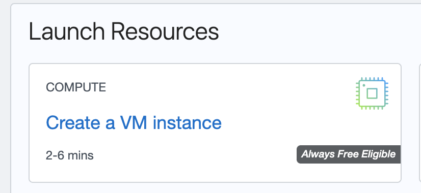

선택 후에 기본적인 세팅을 할 수 있는 페이지가 나오는데, 다음 항목들을 선택하였다.

- name: 추후 관리에 용이하도록 식별할 수 있는 이름 지정
- image: 'Always Free-eligible' 중에 선택하면 되는데 CentOS 8 을 선택했고 특별한 이유는 없음
- networking: 'Public IP address' 체크 (외부 접속을 위하여 필요)
- ssh-keys: SSH 접속을 위해 필요하니 반드시 다운로드 하여 안전한 곳에 보관
- volume: 'Specify a custom boot volume size' 선택 후 50GB 설정

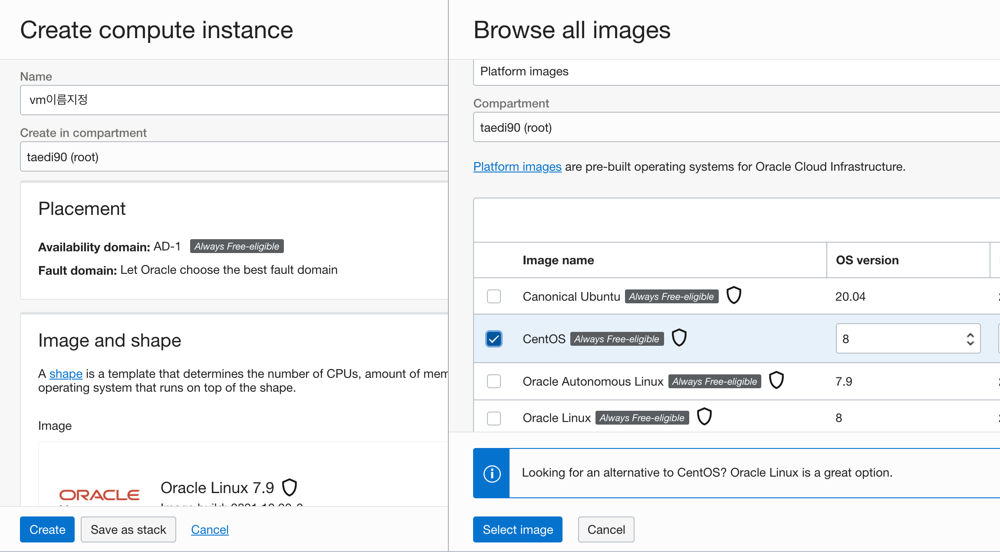

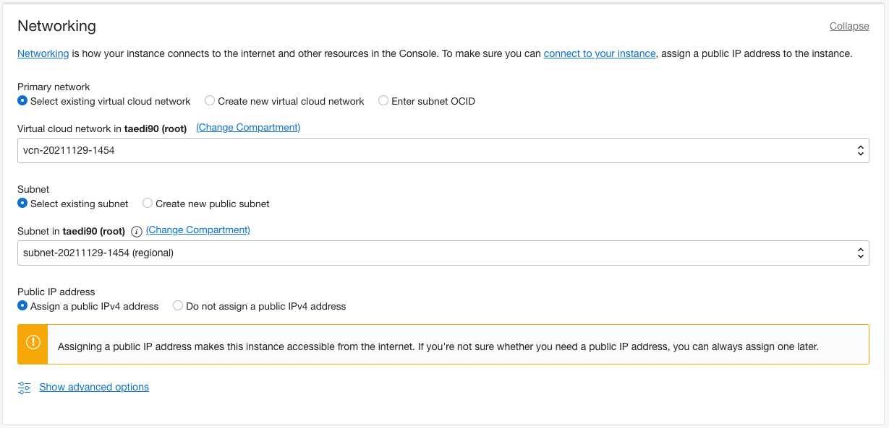

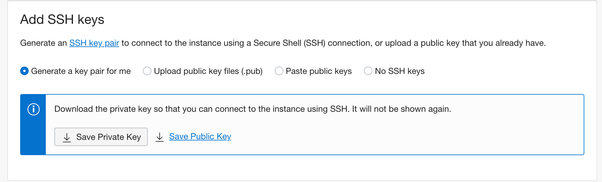

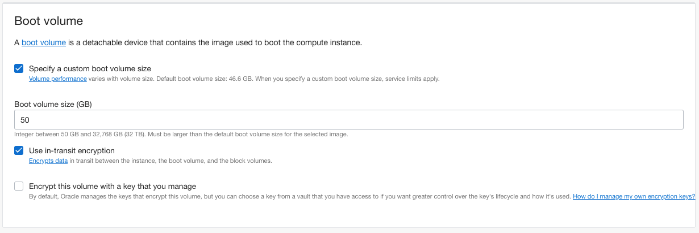

설정을 마친 후에 `create` 를 하면 된다.

### 2-2. 대시보드 확인

설치를 마친 후 대시보드에서 공인아이피와 username 을 체크한다. (SSH 접속에 필요)

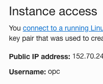

Subnet > Security Lists > Ingress Rules > Add Ingress rules 에서 22 포트(http)와 443 포트(https) 3306포트(SQL)를 개방해주고 추가적으로 필요한 포트가 있다면 마찬가지로 개방해준다.

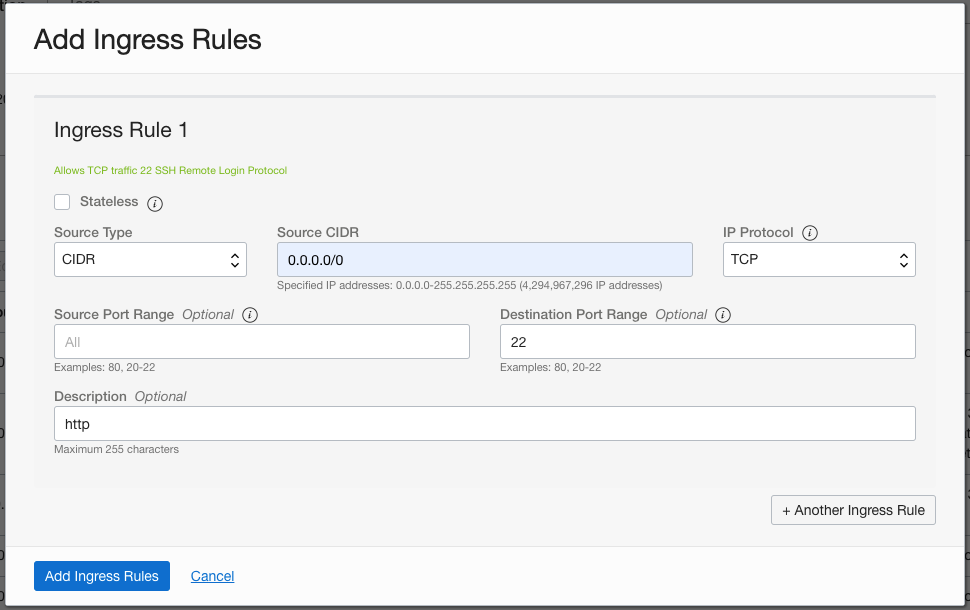

### 2-3. SSH 접속

#### 2-3-1. SSH 접속

맥에서는 터미널에서 ssh 접속이 가능하다.(윈도우는 ssh 클라이언트 프로그램 다운로드 필요) 아까 다운받은 ssh-key가 위치한 디렉토리로 이동해서 ssh 접속을 시도한다.

```bash
# ssh-key가 저장 된 경로로 이동
cd oracle_cloud
# ssh 접속 시도
ssh -i ssh-key.key 아이디@공인아이피
```

혹시나 권한문제로 오류가 발생한다면 디렉토리와 ssh-key 권한을 수정하고 다시 시도해준다.

```bash
# ssh-key 디렉토리
chmod 0700 oracle_cloud

# ssh-key 파일
chmod 0400 ssh-key.key
```

#### 2-3-2. 루트 비밀번호 변경

ssh 접속이 완료되었다면 루트 및 유저 비밀번호를 설정해준다.

```bash
# 루트
sudo passwd root

# 유저
sudo passwd opc
```

#### 2-3-3. ssh-key 없이 로그인 설정

이후 ssh-key 없이 비밀번호를 이용한 접속을 위해서는 sshd_config 파일 수정이 필요하다.

```bash
# /etc/ssh 디렉토리 진입
cd /etc/ssh

# 원본파일 백업
sudo cp sshd_config sshd_config.bak

# 에디터 진입
sudo nano sshd_config
```

에디터로 진입하면 'PasswordAuthentication' 항목을 찾아 yes로 설정한다. (default: no)

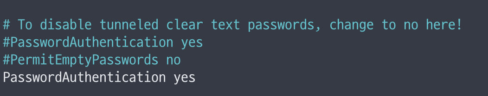

이후 sshd를 재실행 해준다.

```bash
sudo service sshd reload
```

### 2-4. 리눅스 방화벽 설정

리눅스에 기본적으로 iptables 라는 방화벽이 설정되어 있다는데, 오라클 클라우드에 자체적인 방화벽이 있으니 필요하다면 중지해도 된다고 한다. 내용을 잘 몰라 그대로 두려했다가 시도해봤는데 생각보다 애를 많이 먹었다. 

```bash
# 중지
sudo systemctl stop iptables
sudo systemctl stop ip6tables
sudo systemctl stop firewalld

# 비활성화
sudo systemctl disable iptables
sudo systemctl disable ip6tables
sudo systemctl disable firewalld

# 나중에 필요하면 unmask
sudo systemctl mask iptables
sudo systemctl mask ip6tables
sudo systemctl mask firewalld

# 중지 확인
systemctl list-unit-files | grep iptables
systemctl list-unit-files | grep fire
systemctl status firewalld
```

### 2-5. yum 업데이트

CentOS 를 설치하면서 패키지 관리자가 yum(dnf), rpm, deb, apt-get, dpkg 등 다양하게 존재한다는 것을 알게 되었다. 맥에서 homebrew와 같은 역할이지 않을까 싶다.

```bash
sudo yum update

sudo yum upgrade
```

### 2-6. 서버 타임존 설정 & bash 한글 설정

설치 초기에는 시간대가 GMT 기준이기 때문에 로그에 시간이 이상하게 나온다. 타임존을 GMT +9 로 변경해준다.

```bash
# 타임존 설정
sudo timedatectl set-timezone Asia/Seoul
# 설정 확인
timedatectl
```

.bashrc 파일을 수정하면 bash 에서 한글이 깨지지 않고 정상적으로 입력된다.

```bash
vi ~/.bashrc
# 아래 내용을 하단에 삽입
LANG=ko_KR
export LANG
```

### 2-7. 백업 설정(선택)

무료 서비스기 때문에 언제 갑자기 서비스가 종료될지 모른다고 생각해 시놀로지 서버에 자료를 주기적으로 백업할 수 있도록 설정했다. 서비스 종료 우려 외에도 백업 데이터가 있으면 마음이 든든해지니 가급적 세팅하는 것이 좋을 것 같다. 

시놀로지 6버전에서 작업했고 다소 내용이 복잡하다.

#### 2-7-1. 시놀로지 설정

##### rsync 활성화

제어판 > 파일 서비스 > rsync 에서 서비스를 활성화 하고 포트를 지정해준다. (사설IP를 사용한다면 해당 포트 포워딩 등이 필요할 수 있음)

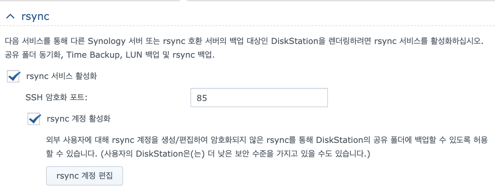

##### 계정 생성

rsync 외의 권한을 최소화 하기위해서 전용 계정을 만들어 주었는데 보안에 신경쓸게 없다면 기존 계정을 그대로 사용해도 된다. 계정에 아래와 같은 권한을 부여해준다.

- administrators 그룹 부여 (ssh 설정 이후 그룹에서 제외할 예정)
- 'homes' 및 'NetBackup' 디렉토리 접근 권한 부여
- rsync 계정 추가 및 비밀번호 지정

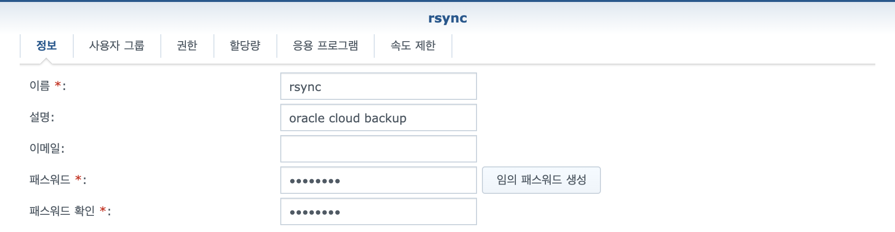

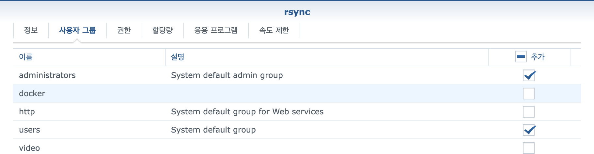

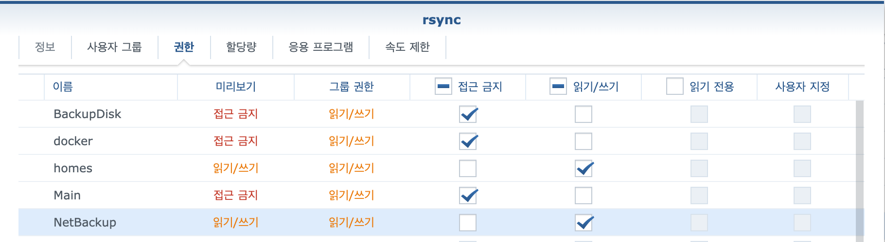

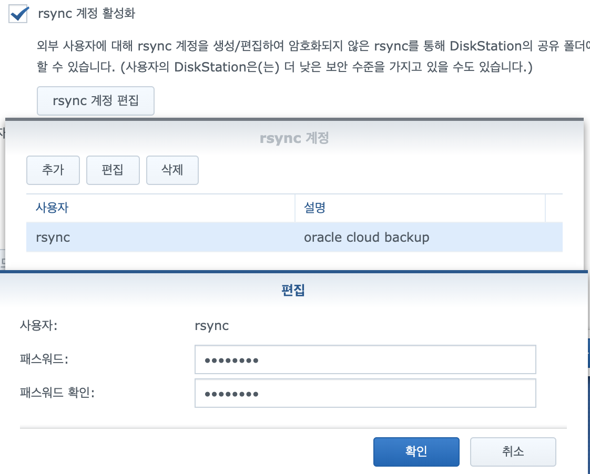

##### ssh 설정

추후 rsync 진행할 때 비밀번호 없이 저장 된 인증키로 접속을 설정하기 위하여 ssh를 잠시 실행하였으며 편의상 rsync와 동일한 포트로 구성하였다.

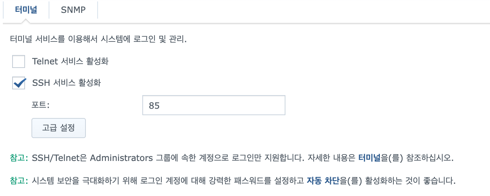

#### 2-7-2. OCI 설정

OCI 서버에 ssh 접속을 하여 ssh-key를 생성해준다.

```bash
[root@centos8 ~]# ssh-keygen -t rsa
Generating public/private rsa key pair.
Enter file in which to save the key (/root/.ssh/id_rsa):
Enter passphrase (empty for no passphrase):
Enter same passphrase again:
Your identification has been saved in /root/.ssh/id_rsa.
Your public key has been saved in /root/.ssh/id_rsa.pub.
The key fingerprint is:
***************************************************** root@centos8
The key's randomart image is:
+---[RSA 3072]----+
|      . .        |
|     + * .       |
|    . B * .      |
|     . @ =       |
|    ..B S o      |
|   ..=oB.B       |
| .. *=+.Bo.      |
|o+ Eooo.o.       |
|.o=. .  .o.      |
+----[SHA256]-----+
```

그리고 아래 명령어로 ssh-key의 내용을 시놀로지 서버의 authorized_keys에 추가하여 준다.

```bash
[root@centos8 ~]# cat ~/.ssh/id_rsa.pub | ssh -p 포트번호 rsync@시놀로지주소 "cat >> .ssh/authorized_keys"
```

#### 2-7-3. 다시 시놀로지 설정

이후에 시놀로지 서버에 ssh 접속을 하여 다음처럼 접근 권한을 변경해준다. (권한설정에 따라 파일이 존재함에도 불구하고 접속시에 비밀번호를 요구할 수 있다.)

```bash
rsync@Taedi_NAS:~$ sudo chmod 755 /var/services/homes/rsync
rsync@Taedi_NAS:~$ sudo chmod 700 /var/services/homes/rsync/.ssh
rsync@Taedi_NAS:~$ sudo chmod 600 /var/services/homes/rsync/.ssh/authorized_keys
```

그리고  sshd_config 파일을 수정하여 인증키로 로그인이 가능하도록 설정을 수정해준다.

```bash
# sshd_config 편집 진입
sudo vi /etc/ssh/sshd_config
```

```bash
# 수정할 내용
PubkeyAuthentication yes
AuthorizedKeysFile  .ssh/authorized_keys
```

그리고 sshd 재시작하면 된다.

```bash
# sshd_config 재시작
sudo synoservicectl --restart sshd
```

이후 시놀로지 제어판에서 ssh 를 비활성화 하고 다시 활성화 하면 접속이 가능하다.

#### 2-7-4. rsync 테스트

CentOS 서버 ssh 에서 다음 명령어를 사용했을 때 비밀번호 입력없이 백업이 시작된다면 설정이 완료 된 것이다. (본인은 이후 시놀로지 ssh 활성화 해제 및 rsync 아이디에 관리자 권한 해제 후에도 정상적으로 동작했음)

```bash
# CentOS '/'폴더 하위의 내용을 시놀로지 'NetBackup/backup/'경로에 복사
rsync -av -e 'ssh -p 시놀로지_포트' / 아이디@시놀로지_주소::NetBackup/backup/
```

작업을 중간에 종료하려면 `ctrl + c` 버튼을 누르면 된다.

#### 2-7-5. crontab 등록

크론탭을 설정하면 윈도우 작업스케줄러 처럼 특정 시간마다 반복적으로 업무를 지시할 수 있다. 

```bash
# 크론탭 편집
crontab -e
```

크론탭에 방금전 테스트 했던 명령어를 매일 7시에 실행할 수 있도록 설정해주었다. (vi 에디터 수정모드는 insert키, 저장은 :wq, 저장없이 나가려면 :qa!)

```bash
* 7 * * * rsync -av -e 'ssh -p 시놀로지_포트' / 아이디@시놀로지_주소::NetBackup/backup/
```

## 참고

- [https://kb.synology.com/ko-kr/DSM/tutorial/How_to_back_up_Linux_computer_to_Synology_NAS](https://kb.synology.com/ko-kr/DSM/tutorial/How_to_back_up_Linux_computer_to_Synology_NAS)
- [https://blog.naver.com/deeperain/222315501853](https://blog.naver.com/deeperain/222315501853)
- [https://forteleaf.tistory.com/entry/synology-ssh-key값으로-비밀번호-없이-로그인](https://forteleaf.tistory.com/entry/synology-ssh-key%EA%B0%92%EC%9C%BC%EB%A1%9C-%EB%B9%84%EB%B0%80%EB%B2%88%ED%98%B8-%EC%97%86%EC%9D%B4-%EB%A1%9C%EA%B7%B8%EC%9D%B8)