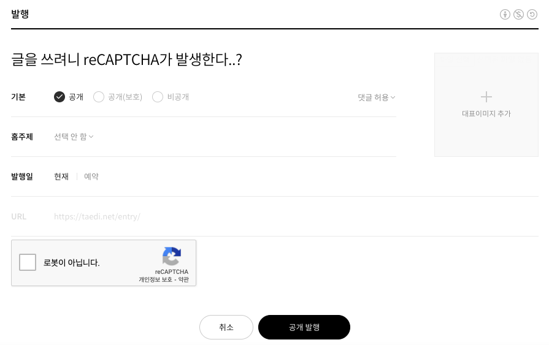
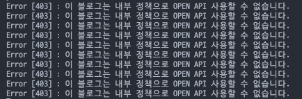

## 서론

코딩 공부를 시작하며 메모는 선택이 아닌 필수가 되었다. 처음에는 **노션**으로 기본적인 메모를 하고 어느정도 정리가 되면 **티스토리**에 업로드를 할 것을 계획했고 포스팅을 조금씩 해나가고 있었는데, 언젠가부터 글을 작성할 때 마다 **reCAPTCHA** 가 발생하기 시작했다.



물론 직접 글을 작성할 때야 체크 항목이 하나 늘어난 것 뿐이지만, 문제는 OPEN API 방식의 포스팅은 완전히 불가능해져 애용하던 Notion2Tistory 를 활용할 수가 없어진 것이 큰 문제였다. (노션에 작성한 글을 API 없이 티스토리에 업로드 하기위해서는 대단한 인내심이 필요했다.)



**reCAPTCHA** 가 모든 블로그에 해당하는 사항이 아니었기 때문에 아무래도 내 블로그가 저품질 판정을 받은 것 같은데, 도배나 광고글을 작성한 적이 없고 게시글 수도 많지않아 이같은 처분이 당황스러워 고객센터에 문의도 해보았으나 이렇다할 답변을 받지 못했고, 티스토리 내에서 해결책을 찾느니 이왕 이렇게 된거 다른 서비스를 찾아보기로 결심하게 되었다.

결론적으로 **Github Pages** 와 **Hugo** 를 활용하기로 결정하였고, 조만간 세팅했던 기억도 가물가물해질 것이 분명하기 때문에 기록으로 남겨놓고자 한다.

## 내게 필요했던 사항

### 1. 노션 메모를 최소한의 수정 또는 무수정으로 배포할 수 있을 것

노션과의 호환성은 0순위였다. 가뜩이나 글을쓰고 정리하는게 어렵게 느껴지는데 플랫폼을 오가며 글을 수정하고 있으면 글을 다듬는 실력은 늘지도 모르겠지만, 그만큼 학습할 시간이 부족해 주객이 전도된다고 느껴졌다.  노션으로 작성한 메모를 마크다운 형식으로 배포할 수 있기 때문에 (문제가 꽤 있다는 것을 후에 깨달았다) 마크다운을 지원하는 medium, velog, wordpress, github pages 들을 리스트에 올렸다.

### 2. 방문 유입은 크게 관계 없음

사실 작성하게 될 글들이 매우 기초적이고 오류 투성이가 될 예정이라 많은 노출은 부담스럽다. 그래서 velog 같은 서비스도 괜찮다고 생각했지만 전문적인 글들 사이에 나의 초라한 메모가 혹여 노출되진 않을까 하는 자격지심에 나중에 기회가 되면 사용해보겠다고 마음먹었다.(고수분들이 지켜보고 있다..!  ' ';)

### 3.  무료이고 안정적인 서비스

면 좋겠다고 생각했다. 다행이도 대부분의 서비스가 무료 플랜이 존재하였고 안정적으로 보였다. 

### Github Pages를 선택한 이유

개별적인 설정도 필요하여 다른 서비스에 비해서 시간투자가 예상되긴 했지만, 그만큼 자유도가 높지 않을까 생각되기도 했고 git pull 한번이면 손쉽게 게시했던 내용을 백업할 수 있다는 점이 매력적이었다. 공부하는셈 치자는 합리화와 함께 **Github Pages** 를 선택하게 되었다. **Github Pages** 에 적용할 수 있는 블로그 프레임워크 중에 **Jekyll** 과  **Hugo** 가 인기가 있는듯 했고, 기존에 Jekyll 로 세팅을 해봤기 때문에 이번엔 Hugo 를 선택하였다.

## 설치

### 1. 휴고 설치

```bash
brew install hugo
```

brew 명령어를 사용할 수도 있으나 arm맥에서 정상적으로 작동하는지 확인되지 않아 직접 다운받아 알맞은 경로에 압축을 풀고 path를 설정해 주었다.

> [https://github.com/gohugoio/hugo](https://github.com/gohugoio/hugo)

```bash
export PATH="/Users/taedi/hugo/bin:$PATH"
```

### 2. 사이트 생성

```bash
hugo new site taedi90.github.io -f=yaml --force
cd taedi90.github.io
git init
```

### 3. 테마 다운로드

테마는 Hugo 사이트에서 여러가지 중에 선택할 수 있는데 테마마다 설정들이 조금씩 달라 자주 변경하는 것은 쉽지 않을 것 같다.  목차와 카테고리 기능이 필요해 [Toha 테마](https://themes.gohugo.io/themes/toha/)를 선택했다

```bash
it submodule add https://github.com/hugo-toha/toha.git themes/toha
```

### 4. 기본 설정

테마마다 설정이 다를 수 있으므로 각 테마의 readme.md 파일이나 Docs 사이트를 확인하여 config.yaml 파일을 알맞게 수정해준다.

### 5. 실행

실행은 아래 명령어 중에 선택하여 입력하면 된다. '-D'는 front matter 에 draft가 true로 체크 된 컨텐츠도 빌드하여 확인할 수 있도록 해준다.

```bash
hugo server -D
hugo server --bind 아이피주소 -D
```

### 6. 댓글기능 (utterances) 추가

깃허브에 Public 리포지토리를 추가해준다. 리포지토리 명은 'blog_comments' 로 지정해 주었다.

그리고 [여기](https://utteranc.es/)를 눌러 방금 생성한 리포지토리에 utterances 를 설치하고 스크립트를 테마의 알맞은 부분에 넣어주면 된다.

## 참고

- [https://gohugo.io/getting-started/quick-start/](https://gohugo.io/getting-started/quick-start/)
- [https://ialy1595.github.io/post/blog-construct-1/](https://ialy1595.github.io/post/blog-construct-1/)
- [https://utteranc.es/](https://utteranc.es/)