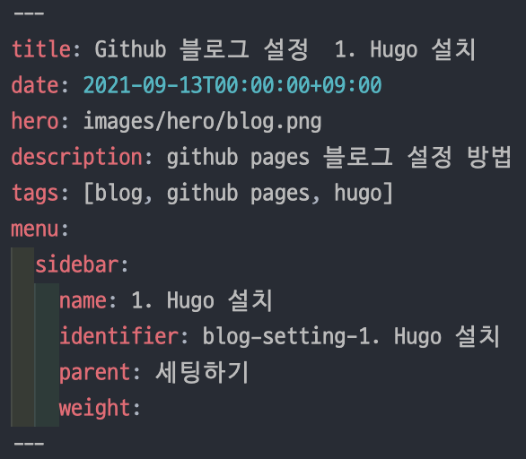
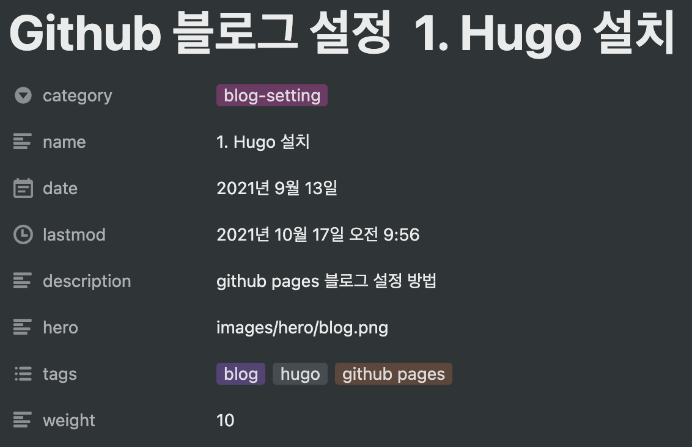
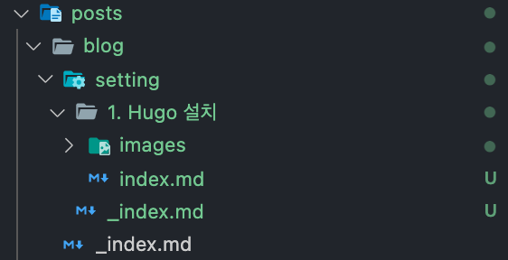
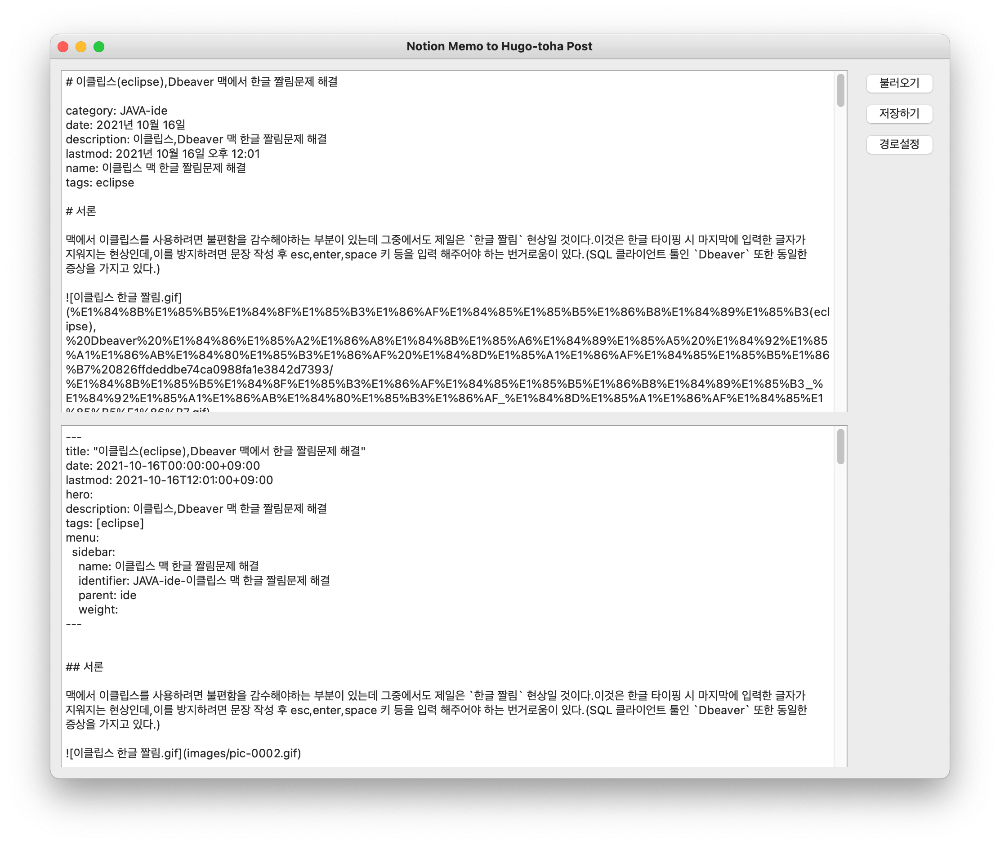

노션은 기본적으로 작성한 글을 마크다운으로 내보낼 수 있는 기능이 있어 hugo 포스팅을 하는데 탁월할 것이라 생각했다.


하지만 노션의 내보내기 기능은 어딘가 아쉬운 부분이 있어 이것을 조금 손봐줄 필요가 있었다.

## 추가 작업

### H 태그

노션은 h1 ~ h3 태그만 지원하며 h4~h6 태그는 없다. 그런데 h1 태그는 포스트에 여러개 존재하면 SEO 점수에 좋지 않은 영향을 미치기 떄문에 hugo 포스팅을 염두에 둔다면 h2 와 h3 태그만 사용해야하는 문제가 발생한다.

그대로 사용하기엔 기존의 글을 그대로 옮기기 위해 추가적인 작업이 필요한 문제와(h1 태그 안쓴 글이 없었다..)  평문과 두 종류의 Heading 만으로 표현하기에는 제약이 많다는 점 때문에 손봐줄 필요성을 느꼈다.

그래서 h1 ~ h6 태그를 h2 ~ 볼드체 한 단계씩 낮추는 작업을 추가하였다.

```python
# h태그 단계 낮추기
    for p in paragraphs:
        # ``` 코드블럭 확인(스페이스 제외)
        if re.match('[\s]*```', p):
            blockquote ^= 1
            
        # 코드블럭 내부인 경우 h 태그 탐색안함
        if blockquote == 1:
            modParagraphs.append(p)
            continue
        
        # > 인용문 줄바꿈 풀리는 현상(다단 인용은 처리 어려움)
        if re.match('[\s]*>' , p):
            quotation = 1
        elif quotation == 1 and re.fullmatch('', p):
            quotation = 0   # 인용문 종료
            
            
        # > 인용문 줄바꿈 처리, h 태그 탐색안함
        if quotation == 1:
            modParagraphs.append(p + '  ')
            continue
        
        # h1 ~ h5 태그 hn + 1 태그로 바꾸기
        if re.match('[\s]*#{1,5}\s', p):
            p = re.sub('([\s]*#{1,5})\s',r'\1# ', p) 
        
        # h6 태그는 볼드체로 수정
        elif re.match('[\s]*#{6}\s', p):
            p = re.sub('([\s]*)#{6}\s([\W\w]*)',r'** \1\2 **', p)
```

처음에 정규식 1줄로 해결하려고 해보았지만 코드블럭, 인용문, 본문 사이사이의 # 문자 등 변수가 많았고(코드블럭과 인용문 내부의 # 태그는 손대지 않는다!), 결국 본문을 줄바꿈 문자를 기준으로 나누어 다소 복잡한 구문으로 변환작업을 구성했다.

### 이미지 파일 경로

한글이 인코딩 된 방식인데 이상하게 한글 하이픈 숫자 조합은 엑스박스라는 결과물이 나온다. (한글까지만 적힌건 괜찮고, 영어 하이픈 숫자는 또 괜찮다..) 뒤늦게 생각해보니 노션과 휴고 url 인코딩 방식이 달라서 그렇지 않았나 싶은데 조금 무식하게 이미지 파일 주소와 이름을 아예 바꿔버리는 방식을 택했다.

> 테스트 이미지1.jpg → pic-0001.jpg  
>   

```python
# 이미지 파일명 변경
for img in imgs:
    img_ext = re.sub("[\w\W]+?(\.[\w]+?\Z)",r"\1",img) # 확장자 가져오기
    rename_img = "pic-{0:04d}".format(idx) + img_ext # 변경할 이름 설정
                
    origin_img_path = rename_img_dir_path + "/" + img
    rename_img_path = rename_img_dir_path + "/" + rename_img

    os.rename(origin_img_path, rename_img_path) # 파일 이름 변경

    img_dict[img] = rename_img # 변경 전/후를 딕셔너리 쌍으로 저장

    idx += 1
```

```python
# 본문 이미지 링크 수정
if 'img_dict' in globals():
    for key, val in img_dict.items():
        origin_path = parse.quote(origin_img_dir_name + "/" + key, '/!@#$&()_-+=~\';,')
        fix_path = rename_img_dir_name + "/" + val
        body = body.replace(origin_path, fix_path)
```

나중에 시간이 된다면 이 부분은 좀더 세련된 방식으로 바꿔야 할 듯 하다.

### 날짜 포맷

노션에서는 날짜 포맷이 다음과 같다.


이걸 hugo에서 활용하려면 "2021-10-16T23:43:00+09:00" 와 같은 형식으로 변경해주어야 했다.

이 부분은 datetime 과 pytz 로 해결하였다.

```python
from datetime import datetime
import pytz

def str_to_date(str):
    TIME_ZONE = pytz.timezone('Asia/Seoul')
    str = re.sub("오후", "PM", str)
    str = re.sub("오전", "AM", str)

    try:
        res = datetime.strptime(str, "%Y년 %m월 %d일 %p %I:%M")
    except ValueError:
        try:
            res = datetime.strptime(str, "%Y년 %m월 %d일")
        except ValueError:
            res = datetime.now()

    res = TIME_ZONE.localize(res).isoformat()
    return res
```

### 줄바꿈

노션에서 내보내기한 md 파일은 기존의 줄바꿈이 제대로 반영되어 있지 않다. 몇줄을 띄우더라도 한줄만 넘어간다.

한 줄은 너무 답답하게 느껴져 두줄씩 더 띄울 수 있도록 정규식을 짜 보았다.

```python
# 줄바꿈 간격 수정 (코드블럭 아래는 줄바꿈이 안됨)
body = re.sub("(```\w[^`]*?```\n)?([^`]*?)\n\n", r"\1\2" + ("\nㅤ  " * 3) + "\n", body) 
body = re.sub("(```)\n\n", r"\1" + ("\nㅤ  " * 3) + "\n", body)
```

현재는 정규식으로 처리하지 않고 css로 줄간격을 조정하고있다.

### front matters 입력

hugo 에 포스팅을 하기위해서는 md 파일 상단에 아래 사진처럼 front matters를 입력해야한다. 



노션에서 아래와 같이 속성을 입력하면 md 전환 시에 지정된 폼으로 변경될 수 있도록 세팅하였다. 



### 부모 폴더 생성 및 _index.md 파일 처리

이 부분은 노션의 문제는 아니고 hugo 포스팅 시에 느낀 번거로운 점이다. 글을 게시하려면 front matters 에 입력한 identifier 에 맞춰 폴더들을 생성하고 폴더에 게시글이 없는 폴더의 경우 _index.md 파일도 생성해 주어야 한다. 



그래서 이 부분은 front matters 를 파싱해 자동으로 경로를 생성하고 _index.md 파일을 생성하도록 설정했다.

```python
# 프로젝트 폴더가 있으면 content 폴더 + 부모폴더에 저장
if(is_project_path):
    path = path + '/content/posts'
    posts_path = path # _index.md 생성용도
    for category in categories:
        path = path + '/' + category
    
path = path + '/' + name
    
try:
    shutil.copytree(temp_path, path)
except:
    copy_tree(temp_path, path)
        
# 부모폴더에 _index.md 만들기
if(is_project_path):
    for category in categories:
        posts_path = posts_path + '/' + category
        index1 = posts_path + "/index.md"
        index2 = posts_path + "/_index.md"
        if not os.path.isfile(index1) and not os.path.isfile(index2):
            md = open(posts_path + '/_index.md', 'wt', encoding='UTF8')
            md.write(get_index_md(category))
            md.close()
```

## 그 밖에 해결 못한 것들

인용문 안에 줄바꿈이 있을 경우 인용문이 풀리는 현상, 인용문 안의 인용문, 북마크 기능, 인라인 리스트 등  노션 페이지를 마크다운으로 변경하면 훼손되는 폼이 꽤 많다는걸 작업하는 도중에 깨달았다. (사전 조사 부족) 뒤늦게 html 파일로 내보내기를 해서 작업을 했다면 퀄리티가 낫지 않았을까 하는 생각이 들었다. 역시 마크다운은 간결한 맛이 최고라는 자기위안으로 더이상의 삽질은 하지 않기로 다짐했다.

## 결과물

앞서 말한 내용을 매번 하기 귀찮기 때문에 변환 툴을 만들었다. 다듬어야할 부분이 많겠지만 일단 내가 사용하는 범위에서는 잘 작동한다.



링크 : [https://github.com/taedi90/notion2toha](https://github.com/taedi90/notion2toha)